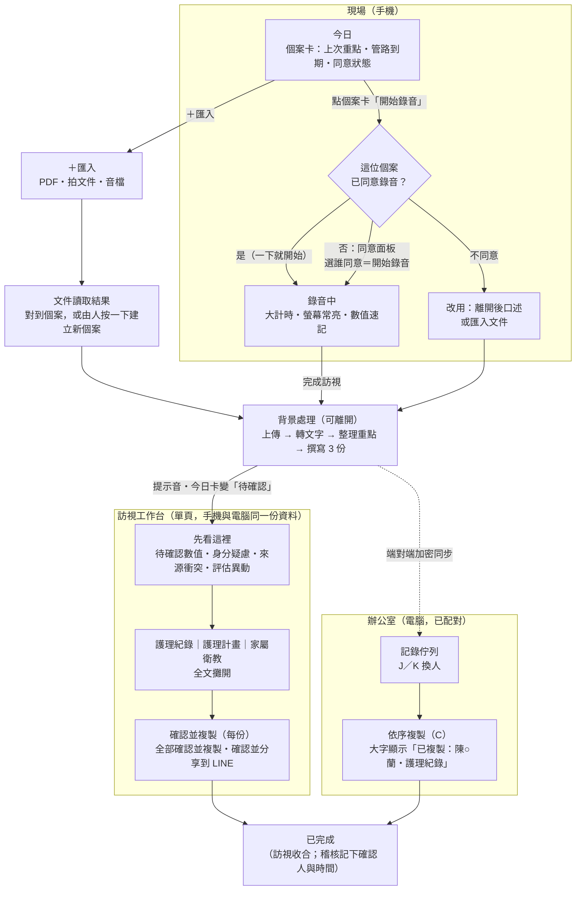
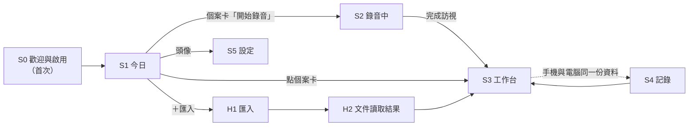
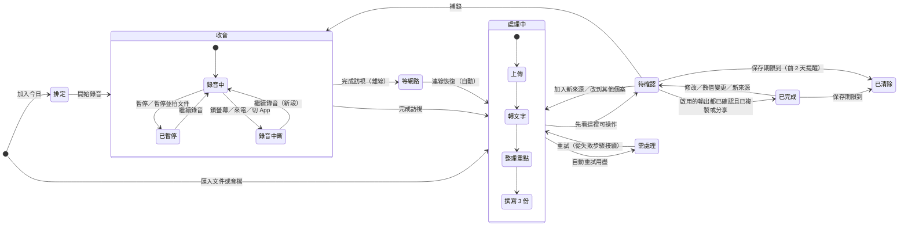
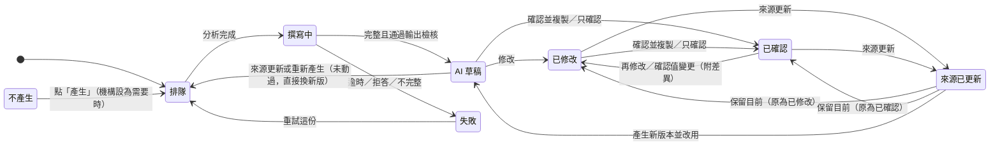
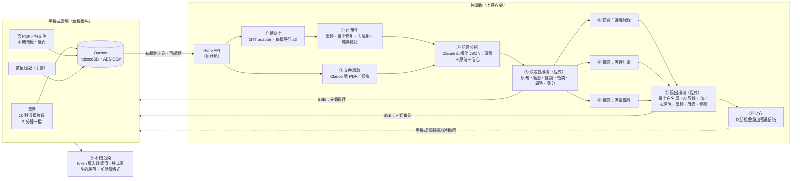

# 02 · 使用者流程規格（最終版）

## TaiOne care · We care：居護師的 AI 記錄助理

> - 版本：v1.0 定稿（2026-10-02）
> - 角色：首席產品設計師的最終合成。以 **C 場域優先** 為骨架，核心換成 **B 信任優先** 的核對與狀態機，數字防線採 **A 速度優先** 的做法，並逐條滿足三位評審（居護師、臨床安全與合規、工程）的必備條件、修正每一個致命缺陷。
> - 依據：內部研究綜整 SYNTHESIS（含場域回饋與證據連結，因涉及合作機構資訊，不放在公開 repo；公開摘要見 [`01-research-summary.md`](01-research-summary.md)）、三份獨立流程設計（A／B／C）與三位評審意見。Claude API 細節已依 claude-api 技能文件核對（§7.13）。
> - 視覺 token（色彩、字體、圓角、陰影）以 [`03-design-system.md`](03-design-system.md) 為準；本文件規定**語意、尺寸下限與互動**，並在 §13.3 列出對 03 的兩處修訂。
> - 代碼：`F-*`（待修）、`K-*`（保留）、`Q*`（需求）、`D*`（設計啟示）引用 SYNTHESIS；`A／B／C` 指三份設計；`J-N／J-S／J-E` 指居護師、安全、工程三位評審；本文件的決策編為 **U01–U46**（§12）。
> - 隱私：所有個案、數值、機構、電話都是**虛構**。姓名一律以遮罩後的樣子出現（例：陳○蘭）。

---

## 0. 一句話定位與設計北極星

**一句話**：在案家按一下開始錄音、離開時按一下完成；AI 在背景把錄音或 PDF 整理成「護理紀錄、護理計畫、家屬衛教」三份草稿，護理師只看一處「先看這裡」，每份一鍵「確認並複製」，整段貼進中衛或傳到 LINE。

### 0.1 三個北極星

| # | 北極星 | 一句話規則 | 落在介面上 |
|---|---|---|---|
| ★1 | **一個動作開始，一個地方核對，一下複製** | 流程只有三步：收音或匯入 → 先看這裡 → 確認並複製。沒有「產生」按鈕，沒有第二道關卡。 | 首頁就是今日個案卡，卡上就是「開始錄音」；工作台最上方是唯一的「先看這裡」；每份輸出底部一顆「確認並複製」，頁底一顆「全部確認並複製」。 |
| ★2 | **數字只信人確認過的，AI 永不覆寫人** | AI 不寫生命徵象；三份裡的量測值由程式從同一份確認值填入，改一次三份一起變。不確定就標「待確認」，不推測。人改過或確認過的內容，AI 只能提出「新版本可比較」。 | 待確認數值附原句、▶ 原音、唯一候選值；版本只增不刪；按鈕文字說實話（「確認並複製」「確認並分享到 LINE」）。 |
| ★3 | **在案家只收，離開後記錄；網路是例外** | 照護中不碰手機；AI 在背景處理，不要求護理師站著等。離線照常錄、看、改、複製。手機收、電腦記錄是同一份資料。 | 「可以先收東西，好了會提醒你」；「等網路」是灰色不是紅色；手機與電腦一次配對後自動同步（端對端加密）。 |

### 0.2 高級質感的定義

「高級」來自**克制與精準**，不是裝飾：每張卡只有一個主要動作；全 App 只有一種「請你看一眼」的顏色（金盞黃，03 的 `--pending`）；生命徵象用 32px 以上的等寬大數字；三份輸出用各自的文件色（03 的珊瑚粉、松石綠、薰衣草）當身分條，但狀態永遠用文字標示；全中文、無英文按鈕；動態 150–200ms 並尊重 `prefers-reduced-motion`。

### 0.3 前後對照（一眼看懂）

| | 現況（SYNTHESIS §2） | 本設計 |
|---|---|---|
| 錄音 → 三份可貼上 | 約 8 個畫面、約 25 下、2 次手動切 Wi-Fi、3–4 次同步等待；紀錄與計畫沒有複製鈕 | **3 個畫面**（今日 → 錄音中 → 工作台）；**最佳 3–4 下、典型 5–6 下**；0 次切網；前景等待約 0 秒（背景處理） |
| PDF → 三份 | 約 63 次互動，**仍然拿不到三份** | 手機 **4–5 下**＋作業系統選檔；桌機 **3–4 下** |
| 回所裡批次 5 位 | 每位約 25 下 | 每位 **3–4 下**，5 位約 15–20 下、10–15 分鐘 |
| 複製一份 | MORE → 長按 → 全選 → 複製 → 返回 | **1 下**，提示字數 |
| 出錯時 | 「發生未知錯誤」、按鈕反灰無說明 | 錯誤代碼＋人話＋「資料還在這台裝置」＋一鍵重試 |

---

## 1. 使用者與情境

### 1.1 主要使用者：居家護理師

**林護理師**（虛構 persona，依 SYNTHESIS §2 與 J-N 自述合成）

| 面向 | 描述 | 對設計的意義 |
|---|---|---|
| 年齡與經驗 | 52 歲，臨床 15 年，居護 6 年；有老花 | 內文 ≥18px、生命徵象 ≥32px、主按鈕 ≥64px；系統字級放大到 200% 不跑版（F-J2、K-J2） |
| 一天 | 5–8 家（一個半天最多 5 家，CV C6），市區加偏鄉，案與案之間開車或騎車 | 首頁就是今日清單；開始下一位時前一位自動記錄；可以在車上記錄 |
| 案家 | 戴手套；家屬在旁講台語；外籍看護在場；4G 時有時無（S10） | 照護中不碰手機；離線照常錄；台語段落標示不推論；門外國語口述 |
| 交付 | 護理紀錄與計畫回所裡用電腦貼進**中衛**（兩個不同欄位）；家屬衛教在門口或車上用 **LINE** 傳給家屬或看護 | 每份單獨「確認並複製」；衛教「確認並分享到 LINE」；電腦上依序複製、每次大字顯示個案名 |
| 被舊版傷過的地方 | BodyCam 要切 Wi-Fi；按鈕藏在下面；沒有複製鍵；念的血壓跟 AI 寫的不一樣（F-B1、F-A1、F-E1） | 不需硬體；數字只信確認值；複製 1 下 |
| 學習 | 「教一次」成功率低，舊版需陪跑 1–2 天、教學 deck 60 頁（F-J1） | 只有 3 個畫面要學；示範模式 3 分鐘學會唯一的關卡 |

**次要角色**：年輕居護師（偏好電腦與鍵盤）、護理長（v1 只透過機構設定與稽核接觸，不是操作者）、家屬與外籍看護（接收衛教，可讀印尼文、越南文、泰文）。

### 1.2 兩種情境（加一個中間地帶）

| 情境 | 地點與裝置 | 時間壓力 | 要完成的事 | 設計回應 |
|---|---|---|---|---|
| **現場** | 案家；手機（面朝上放床邊桌） | 高；雙手在做照護 | 選對個案、開始錄音、（選用）自己打生命徵象、完成訪視 | 個案卡上一鍵開錄；錄音中全螢幕大計時、省電黑幕；數值速記大鍵盤；「完成訪視」後不用等 |
| （中間）**門外、車上** | 手機 | 中；5 分鐘內 | 修正可疑數值、確認評估異動、把衛教傳 LINE | 今日卡變成「待確認」；「先看這裡」一處處理完；「確認並分享到 LINE」 |
| **辦公室** | 所裡電腦瀏覽器（已與手機配對）；也可直接拖放 BodyCam 或語音備忘錄檔 | 低；但要批次處理 5–8 位 | 每位的紀錄與計畫分別貼進中衛 | 記錄佇列＋工作台；J／K 換人；C「依序複製」每次大字寫出個案名，避免貼錯人 |

**一天的節奏**（虛構）：08:30 所裡把明天新收案的病摘 PDF 拖進來 → 09:40 第 1 家開始錄音 → 10:04 完成訪視、收東西 → 10:12 車上修正 1 個數值、確認異動、衛教傳 LINE → … → 12:30 回所裡，電腦上 5 位依序複製貼中衛，約 12 分鐘。

### 1.3 從研究整合的優缺點 → 設計對策

| 類型 | 研究發現（代碼） | 設計對策（決策編號） |
|---|---|---|
| **保留** | K-B1 人工值優先、ASR 原文保留 | 數值速記與手動值永遠勝過語音；人工確認過的值在重新分析時鎖定（U08、U10） |
| 保留 | K-B2 AI 只寫有證據、高信心事實，不填分數、診斷、分期、風險 | 輸出驗證器把關 AI 界線；診斷只照文件原文（U13） |
| 保留 | K-D1 計畫有版本、可跨訪視沿用 | 計畫預設「沿用＋本次評值」，確認後才成為第 N 版（U15） |
| 保留 | K-C1 來源端鎖 zh-TW；K-C3／K-E1 衛教翻譯與 LINE 轉發 | 繁體四道關卡；衛教確認後才能分享或翻成印尼文、越南文、泰文（U18、U19） |
| 保留 | K-E2 AI 文字可直接編輯 | 電腦上點文字即可改；手機用「修改」開全螢幕大字編輯器（U21） |
| 保留 | K-A4 多段合併、管路到期自動算；K-H2 手機錄音可匯入 | 自動切檔合併；管路到期由程式推算並顯示在今日卡；匯入語音備忘錄與 BodyCam 檔（U05、U29） |
| 保留 | K-D2 版本化 AI 資料處理同意；K-J2 易讀模式；K-A2 轉譯快 | 三層同意；易讀為預設；邊錄邊轉（U31、U34、U06） |
| **修正** | F-A4 語音不能回填評估，雙重輸入（Top 1） | 「評估要點」依 16 表標題整理、可複製（U25，v1 P1） |
| 修正 | F-B1 生命徵象數字錯（36.3→16.3）（Top 2） | 「先看這裡」：原句＋▶ 原音＋唯一候選值；fact token；全數字白名單；雙讀比對（U09–U12） |
| 修正 | F-A1 BodyCam 切網傳檔繁瑣（Top 3） | 手機或電腦直接錄；BodyCam 檔改為拖放或選檔，依檔名時間自動分組（U29） |
| 修正 | F-D3 失敗不提示、「未知錯誤」（Top 4） | 錯誤代碼表：每則說在哪一步、為什麼、資料還在不在、下一步，一鍵重試（U37） |
| 修正 | F-C1 簡體字（Top 5）；F-C3 英文按鈕；F-C4 瀏覽器自動翻譯 | 四道繁體關卡＋用語表；全中文介面；`translate="no"`（U18） |
| 修正 | F-A3 三輸出分散、硬性串聯、同步等待（Top 6） | 一次分析、三份平行撰寫；單頁工作台；沒有「產生」按鈕（U07、U14） |
| 修正 | F-F1 PDF 只能在新收案時夾帶、建檔失敗（Top 7）；F-A6 表單冗長 | PDF 與翻拍紙本隨時匯入任何個案；新個案只需按一下確認；主鍵 UUID（U26、U27） |
| 修正 | F-A2 錄後對應個案、死路（Top 8） | 先選個案再錄；臨時個案；「改到其他個案」可復原；永遠沒有「待匹配音檔」（U03） |
| 修正 | F-D1 AI 覆寫不確認、沒有草稿／確認狀態（Top 9）；F-D4 版本難辨 | 明確狀態機；版本只增不刪；人改過的只給「新版本可比較」（U16、U17） |
| 修正 | F-G2 生成失敗約 30%（Top 10） | 單份失敗互相隔離、單份重試；不完整的串流不顯示片段（U37） |
| 修正 | F-D2 生成計畫前不檢查今日評估（Q02） | 評估異動按一下確認並記下人與時間；未確認前計畫不能確認（U12） |
| 修正 | F-E1／F-E2 沒有複製鈕、只顯示 6 行加 MORE | 三份全文攤開；每份 1 下「確認並複製」（U14、U22） |
| 修正 | F-E3／F-E4 目的系統格式不明、欄位不合中衛 | 純文字、Big5 安全、Windows 用 CRLF、字數、只複製內文、分段複製；生命徵象順序可設（U23、U24） |
| 修正 | F-J1／F-J2／F-J3／F-J4 學習成本高、字小、導覽不一致、首頁主動作埋在底部 | 3 個核心畫面；底部導覽 3 項附中文；示範模式教學；大字（U01、U34、U41） |
| 修正 | F-A7 等待看不到進度 | 四步驟文字進度、可離開、完成提示音（U07） |
| 修正 | F-I1 log 含個資、金鑰在前端；F-I3 帳號共用；F-I4 錄音需同意 | 白名單日誌、金鑰只在伺服器；個人 PIN 身分；個案層級錄音同意（U31–U33） |
| 修正 | F-G1 使用量大幅下降、F-K1 無法量測 | 匿名採用遙測、確認／複製／採用分開統計、正式與測試分開（U44） |

---

## 2. v1 範圍

### 2.1 做（v1 必做，P0：沒有就不發版）

| # | 功能 | 為什麼 | 建置要點 |
|---|---|---|---|
| V01 | **PWA 外殼**：同一份 React＋Vite＋Tailwind，手機與平板可安裝，桌機瀏覽器直接用；360–1920px | 使用者要求響應式＋Web；PWA 免商店審核（F-G5） | `vite-plugin-pwa`；`storage.persist()`；iOS 加入主畫面引導 |
| V02 | **今日**：個案卡（上次重點、管路到期、同意狀態）＋卡上「開始錄音」；找個案、新增個案、臨時個案 | Q05、D02、F-J4 | 本機資料立即顯示 |
| V03 | **App 內錄音**（手機與電腦麥克風）：每 3 分鐘在停頓處重啟 recorder 產生獨立檔、每 10 秒落地救援片段、Wake Lock、省電黑幕、中斷續錄、暫停、刪除剛剛 30 秒、數值速記、補一段口述、同戶下一位 | F-A1、F-A2、F-B1、Q04、Q18 | `MediaRecorder`；webm/opus 或 mp4/aac 皆收 |
| V04 | **匯入**：PDF（含掃描）、照片（翻拍紙本）、音檔（多段、BodyCam `A_yyyyMMddHHmmss`）；任何時候、任何個案；桌機拖放＋明顯的「選擇檔案」 | Q03、F-F1、F-A6、K-H2、S26 | `pdfjs-dist` 預檢；`pdf-lib` 選頁 |
| V05 | **同意與身分**：版本化 AI 資料處理同意；個案層級錄音同意（同意者、方式、告知詞版本、效期、可撤回）；個人身分（機構通行碼＋姓名＋個人 PIN） | K-D2、F-I4、S16、F-I3 | PIN 只存本機雜湊；伺服器只知道 nurseId |
| V06 | **AI 管線**：STT adapter（TaiOne Azure zh-TW／Whisper 相容／瀏覽器聽寫〔預設關〕／示範）→ 正規化 → 文件讀取 → 語意分析 → 決定性檢核 → 三份平行撰寫 → 輸出檢核 → 本機渲染 | D03、F-A3、F-B1、F-C1 | Hono 無狀態工作；Claude `claude-opus-5-5`（§7） |
| V07 | **訪視工作台**：進度、先看這裡、三份全文、確認並複製、全部確認並複製、確認並分享到 LINE、分段複製、修改、單份重新產生、版本、來源（逐字稿、▶ 原音、PDF 頁） | D04–D07、D17、F-E1、F-D1 | 單頁；手機有頂部跳轉列與底部固定行動列 |
| V08 | **護理計畫沿用＋本次評值**；AI 建議新增問題需按「採用」；確認後設為第 N 版 | Q08、Q02、K-D1、D12 | 計畫上下文＝確認事實＋現行計畫 |
| V09 | **衛教翻譯**：印尼文、越南文、泰文；中文確認後才翻，標「AI 翻譯」 | K-C3、Q09（J-N：v1 就要有） | 獨立請求，失敗不影響中文 |
| V10 | **狀態機與版本**：訪視與每份輸出的狀態；版本只增不刪；stale 規則 | D06、F-D1、F-D4、Q19 | XState 或 typed reducer，附信任規則測試 |
| V11 | **失敗處理**：錯誤代碼表、離線佇列、從失敗步驟接續、單份隔離 | D08、F-D3、F-G2 | 每個錯誤都有代碼與動作 |
| V12 | **本機優先儲存**：Dexie＋WebCrypto AES-GCM、每次訪視一把金鑰、到期刪金鑰（crypto-shredding）、App 鎖 | D18、K-I2 | 金鑰不可匯出 |
| V13 | **手機 ↔ 電腦**：一次 QR 配對，之後端對端加密信箱自動同步（不含錄音） | J-N 底線 #12；情境 (d) | 伺服器只存密文，72 小時 TTL |
| V14 | **桌機記錄**：佇列＋工作台、J／K 換人、C 依序複製（大字個案名）、拖放分組 | D16、F-A5、CV C3 | ≥1200px 版型 |
| V15 | **剪貼簿**：純文字、Big5 安全（建置時產生的 BMP 位元表）、Windows CRLF、字數、只複製內文、全部複製分隔線 | F-E3、§7.1-10 | 不把 iconv 打包進前端 |
| V16 | **示範模式**：無金鑰也能走完；內建 16.3℃ 辨識錯誤、2 項評估異動、計畫建議；固定橫幅 | Q24、F-J1 | 示範不把任何真實聲音送出 |
| V17 | **伺服器端稽核（不含內容）＋停用 AI 開關** | SA §7–8、J-S #12、#16 | append-only，≥3 年 |
| V18 | **輕量回饋與匿名遙測**：👍／👎＋原因選單；各階段耗時、失敗代碼、確認／複製／採用次數 | D20、F-D6、F-K1、Q25 | 只送計數與耗時，不送文字 |

### 2.2 做（v1 應做，P1：排在 P0 之後，仍屬 v1）

| # | 功能 | 為什麼 |
|---|---|---|
| V19 | **評估要點可複製**：依中衛或 16 表標題整理本次找到的事實（只含 found） | F-A4 Top 1、Q01；J-N 底線 #19 |
| V20 | **「重寫這幾段」**：數值改動後轉黃的判讀段落，只重寫那幾段 | A 的點子；段落層級，不做句子層級合併 |
| V21 | **並排檢視**（≥1440px）：三份輸出並排 | J-E：只在 ≥1440px |
| V22 | **增量分析**：錄音中每完成一檔就先做部分分析（僅在 p50 >20 秒時開啟） | 延遲備案 |
| V23 | **公用電腦模式**：資料只放記憶體、關分頁即清除 | C 的點子 |
| V24 | **匯出加密備份**（`.taione` 檔，換手機用） | 對付 iOS 清資料 |

### 2.3 不做（之後）

| 不做 | 何時 | 原因（研究依據） | v1 怎麼銜接 |
|---|---|---|---|
| Web Push 完成通知 | v1.1 | iOS 需加入主畫面＋VAPID；J-N 接受「通知**或**提示音」 | v1 用提示音、震動（Android）、今日卡狀態、分頁標題 |
| PDF 密碼直接輸入解密 | v1.1 | 前端解密並轉影像需額外測試 | v1 提示「另存無密碼版或改用拍照」 |
| 原生殼（Capacitor）背景錄音 | v1.1–v2 | PWA 在 iOS 鎖螢幕或切 App 會中斷收音 | v1：螢幕常亮、省電黑幕、中斷一鍵續錄、匯入系統錄音檔 |
| 生物辨識解鎖（WebAuthn） | v1.1 | 範圍控制（J-E） | v1 用個人 PIN |
| 台語 STT、講者辨識顯示 | v1.1 評估 | 台語無實測數據（F-C2） | 標示疑似台語段落、不推論；門外國語口述 |
| 差異高亮比較（字元級 diff） | v1.1 | 成本高、收益小（J-E） | v1 的「新版本可比較」以全文切換或並排呈現 |
| HIS、中衛、健保申報串接 | v2 | brief 明訂 v1 不做；院方 HIS 推入曾長期失敗（F-G3）；技術可寫回不等於臨床可寫回（S25） | 輸出是結構化 JSON，日後可映射欄位；v1 以複製貼上為橋 |
| 16 張全人評估表的編輯與自動回填 | v2 | 表單產品，建置量大；16 表逐張確認本身就是痛點（F-A6） | V19 評估要點複製；分析 schema 的 `formSlug` 預留對應 |
| 訪視紀錄單 PDF 匯出 | v2 | 中衛北區模板未驗收（F-E3） | — |
| BodyCam Wi-Fi 直連、藍牙識別證、GPS 到案 | v2 | 正是最繁瑣的步驟（F-A1、S08）；硬體未定（S11）；位置隱私 | 檔案匯入；STT adapter 介面可接外部來源 |
| 雲端帳號、SSO、多人共享個案、代理人、護理長後台與儀表板 | v2 | 範圍（J-E）；非本次使用者 | v1：個人 PIN＋伺服器稽核；匿名遙測先收資料 |
| 伺服器內容資料庫 | 不做 | 違反本機優先；擴大個資面（J-S、J-E） | 端對端信箱只存密文 |
| 量表分數計算、診斷、傷口分期、風險分級、傷口影像判讀 | 不做 | AI 寫入界線（spec 2026-07-13、K-B2） | 只照抄來源中已有的分數或分期，並標明出處 |

---

## 3. 流程總覽與主流程

### 3.1 流程總覽



### 3.2 計數規則（照實計算）

- **起點**：App 已開在「今日」且已解鎖。PIN 解鎖不計入每日路徑。
- **App 內點擊**：每一次觸碰或點擊都算 1，包含面板選項；電腦上的鍵盤快捷鍵也算 1。
- **OS**：作業系統的檔案選擇器、相機快門、分享面板、LINE 內的選擇另外列為「OS」。
- **不計**：捲動、閱讀、在其他系統（中衛、院方系統、LINE）裡貼上。
- **最佳**：沒有待確認數值、沒有評估異動。**典型**：1 個待確認數值（採用候選值）＋評估異動要確認一次。
- 等待時間是**設計目標**，上線前必須實測（§11）。

### 3.3 路徑 (a)：在案家錄音 → 三份已複製（手機）

情境：週四上午第 2 位個案，陳○蘭（虛構）84 歲，鼻胃管、導尿管、薦骨壓傷，女兒與印尼籍看護在場。已在今日清單，9/18 已記錄錄音同意。

| # | 地點 | 護理師動作 | 點擊 | 累計 | 畫面 | 系統行為與等待 |
|---|---|---|---|---|---|---|
| 0 | 案家門口 | 看今日卡：「上次：飯前血糖偏高・導尿管 10/20 到期・計畫第 3 版」 | 0 | 0 | 今日 | 本機資料，離線可讀 |
| 1 | 進門寒暄後 | 在**陳○蘭的卡片上**點「開始錄音」 | **1** | 1 | → 錄音中 | 1 秒內開始收音；提示音；頂部常駐「● 錄音中・已告知（9/18 同意）」 |
| 1′ | （此個案第一次錄音才有） | 同意面板唸大字告知詞，點「家屬同意，開始錄音」（選誰同意的那一下就開始錄） | +1 | (2) | 錄音中 | 記錄同意者、方式、告知詞版本、效期 |
| 2 | 照護中，約 25 分鐘 | 手機面朝上放床邊桌，不碰 | 0 | 1 | 錄音中 | Wake Lock；10 秒後轉省電黑幕；每 10 秒落地、每 3 分鐘切一檔；有網路就**邊錄邊轉** |
| 2′ | （選用）量完血壓 | 點「數值速記」→ 大鍵盤輸入 → 點「好」 | +2 | — | 數值速記面板 | 手動值標「手動」，永遠勝過語音 |
| 3 | 出門前 | 點「完成訪視」 | **1** | 2 | → 工作台（處理中） | 「可以先收東西，好了會提醒你」；最後一檔上傳與轉文字約 3–10 秒 |
| 4 | 收東西、道別，1–3 分鐘 | 不碰手機 | 0 | 2 | — | 分析約 8–15 秒 → 「先看這裡」可操作（p50 ≤20 秒）；三份平行串流；完成時提示音，今日卡變「待確認」 |
| 5 | 門外或車上 | 點今日卡「查看並複製」（若一直停在工作台則 0） | **0–1** | 3 | 工作台 | — |
| 6 | 先看這裡 | 「⚠ 體溫 16.3℃ 可能聽錯」→ 點「改成 36.3」 | 0–1 | 3–4 | 工作台 | 三份中的體溫即時更新，不需重寫 |
| 7 | 先看這裡 | 「評估異動 2 項：痰液增加、3 天未解便」→ 點「異動已確認」 | 0–1 | 3–5 | 工作台 | 記錄確認人與時間（Q02）；計畫解鎖 |
| 8 | 閱讀 | 由上往下捲：紀錄 → 計畫 → 衛教（全文，無 MORE） | 0 | — | 工作台 | 計畫的「建議新增」可按「採用」（+1，選用） |
| 9 | 複製 | 點底部「全部確認並複製（3 份）」 | **1** | **3–6** | 工作台 | 提示「已確認並複製 3 份（紀錄 486 字、計畫 702 字、衛教 341 字）」；三份標「已確認・林護理師 10:12」；計畫設為第 4 版 |

**結果**：最佳 **3 下**（停在工作台）或 **4 下**（離開再回來）；典型 **5–6 下**；最多 7 下（加採用 1 項建議）。3 個畫面，0 次切網，前景等待約 0 秒。

### 3.4 路徑 (a′)：真實的一天（衛教傳 LINE、紀錄與計畫回所裡貼中衛）

依 J-N 的實算方式：錄完不會站在客廳等；衛教在車上傳；紀錄與計畫回所裡在電腦貼進中衛兩個欄位。

| 地點 | 動作 | App 點擊 | OS |
|---|---|---|---|
| 案家 | 開始錄音、完成訪視 | 2 | — |
| 車上（手機） | 點今日卡（1）→ 改成 36.3（1）→ 異動已確認（1）→ 家屬衛教「確認並分享到 LINE」（1） | 4 | LINE 選聊天室、送出 2–3 |
| 所裡（電腦，已配對） | 記錄頁自動開第一位（0）→ C「確認並複製護理紀錄」貼中衛（1）→ C「確認並複製護理計畫」貼中衛（1）→ J「完成，下一位」（1） | 3 | — |
| **合計** | | **9** | 2–3 |

對照：A 約 8 下（但會猜錯個案、Q02 只是建議卡）、B 約 13 下、C 約 9 下、舊版約 25 下＋2 次切 Wi-Fi（J-N §1）。

### 3.5 路徑 (b)：匯入 PDF（全人評估或出院病摘）→ 三份

**(b) 手機，新個案**：醫院把出院病摘 PDF 傳給家屬，家屬再用 LINE 傳給護理師，檔案已存在手機。

| # | 動作 | 點擊 | 累計 | 畫面 | 系統行為與等待 |
|---|---|---|---|---|---|
| 1 | 底部導覽中央「＋匯入」 | 1 | 1 | 匯入面板 | 4 個大選項：拍文件／選 PDF 檔／選錄音檔／新增個案 |
| 2 | 「選 PDF 檔」 | 1 | 2 | OS 選檔（OS 1–2） | 本機預檢：頁數、大小、加密 |
| 3 | （可離開） | 0 | 2 | 文件讀取中 | 「正在讀第 3／8 頁」；文字型約 10–20 秒，掃描檔約 30–60 秒 |
| 4 | 讀取結果：「出院病歷摘要・2026/09/28・8 頁；84 歲女性；找不到相符個案」→ 點「建立新個案並產生 3 份」 | 1 | 3 | → 工作台 | **一定由人按這一下**才建立個案；找到相符個案時按鈕改為「加入 陳○蘭 並產生 3 份」 |
| 5 | 先看這裡的「文件重點」：12 項，其中 2 項「字跡不清」→ 看過頁面縮圖，點「文件重點已對照」 | 0–1 | 3–4 | 工作台 | 沒有字跡不清的項目時不需這一下（在「確認並複製」時一併記錄）；字跡不清的值不寫入輸出，改列「待訪視確認事項」 |
| 6 | 「全部確認並複製（3 份）」 | 1 | **4–5** | 工作台 | 護理紀錄自動套用「收案紀錄（依文件整理）」模板，**沒有「今日」生命徵象**；計畫為新擬第 1 版 |

**(b′) 電腦**：把 PDF 拖到視窗任何地方（1）→「建立新個案並產生 3 份」（1）→（0–1）→「全部確認並複製」（1）＝ **3–4 下**。拖放區旁一定有「選擇檔案」按鈕（BF T4 反例：拖放看似可行，實際上傳不了）。

**既有個案補傳 PDF（Q03）**：今日卡或個案資訊的「⋯ → 匯入文件」，個案已經選定，不需要建立步驟。失敗可重試，不會被「病歷號已存在」擋住（主鍵是 UUID，F-F1）。

### 3.6 路徑 (c)：PDF＋錄音合併

**(c1) 前一天在所裡匯入病摘，隔天到案家錄音**（初訪最常見）

| # | 地點 | 動作 | 點擊 |
|---|---|---|---|
| 1 | 所裡電腦 | 把出院病摘 PDF 拖進「今日」 | 1 |
| 2 | | 讀取結果點「建立新個案，只存為背景資料」 | 1 |
| 3 | | 提示列點「加入明日」 | 1 |
| 4 | 隔天案家 | 同路徑 (a)：開始錄音 → 完成訪視 → 查看 →（數值、異動）→ 全部確認並複製 | 3–6 |
| 5 | 工作台 | 「文件重點」有字跡不清項目時點「文件重點已對照」 | 0–1 |
| | | **合計** | **6–10**（典型 8–9，分兩天） |

管線行為：文件事實（帶文件日期、標「非本次」）和今日事實一起送進分析；兩者不一致時列為「來源衝突」或「評估異動」，由人選，絕不自行挑一個。計畫以「已確認的文件重點＋今日評估」為依據（CV C6 2025/7/3 的要求）。

**(c2) 先錄音，事後補 PDF**：工作台「＋補資料 → 選 PDF 檔」（2 下＋OS）。系統只重做「文件讀取＋分析＋撰寫」：**沒動過的草稿自動更新**，改過或確認過的只顯示「有新版本可比較」。

**(c3) 在案家，家屬遞上紙本**：錄音中點「暫停並拍文件」（1，錄音明確暫停並保存，避免 iOS 相機與麥克風同時使用時中斷收音）→ 系統相機每頁拍 1 張（OS 1–2／頁）→「繼續錄音」（1）→ 之後同路徑 (a)。2 頁合計約 **6–9 下＋OS**。

### 3.7 路徑 (d)：回所裡在電腦上批次完成

**(d1) 已配對（最常見）**：手機上錄的訪視在網路通時已自動同步到電腦（端對端加密，不含錄音）。

| # | 動作 | 點擊／按鍵 | 系統行為 |
|---|---|---|---|
| 0 | 開電腦瀏覽器（已安裝或書籤），輸入 PIN | （解鎖） | 預設頁「記錄」，自動打開第一位「待確認」 |
| 1 | 先看這裡：若手機上沒處理完，點候選值或直接打字、Enter | 0–1 | 右欄逐字稿自動捲到原句並反白；▶ 播放原音（音檔在手機上時顯示「原音在手機」） |
| 2 | 按 `C`：「確認並複製護理紀錄」→ 切到中衛貼上 | 1 | 畫面中央大字：「已複製：陳○蘭・護理紀錄（486 字）→ 下一個：陳○蘭・護理計畫」 |
| 3 | 回來按 `C`：「確認並複製護理計畫」→ 貼上 | 1 | 若衛教已在手機分享（「已分享 10:12」）就跳過 |
| 4 | `J`「完成，下一位」 | 1 | 下一位若還在處理中，自動跳到再下一位 |
| | **每位** | **3–4** | 閱讀加貼上約 1.5–3 分鐘 |
| | **5 位** | **約 15–20** | **約 10–15 分鐘** |

**(d2) 沒配對、或用 BodyCam／語音備忘錄**：把 SD 卡或檔案拖進視窗（1）→ 歸組表依檔名時間（`A_20261002094012`，相隔 >20 分鐘即分開）建議對應今日訪視，**每組由人按「✓」確認**（每組 1；建議錯了用下拉改）→ 自動開始處理 → 之後每位同 (d1)。檔名含個案 ID 時（S11 規則）直接帶入個案。

**(d3) 電腦口述**：家屬不同意錄音的個案，回所裡在個案卡點「口述」（1）→ 對電腦麥克風講 1–2 分鐘 →「完成」（1）→ 同 (d1)。口述段權重最高。

### 3.8 首次使用（一次性，不計入每日）

| 項目 | 點擊 |
|---|---|
| 機構通行碼（或「先用示範個案試試」）→ AI 資料處理同意 → 姓名＋設定 6 位數個人 PIN | 3＋輸入 |
| 手機「加入主畫面」（iOS：分享 → 加入主畫面 → 新增） | OS 3 |
| 允許麥克風（首次錄音時） | OS 1 |
| 連結電腦（電腦顯示 QR，手機「設定 › 連結電腦」掃描 →「確認連結」） | 2＋OS 1 |
| 建立第一位個案：匯入 PDF，或「新增個案」（只要稱呼＋出生年＋性別） | 2–3＋輸入 |

**教學**：不做多頁教學。第一次進今日頁只有一張可關閉的提示卡「三步：開始錄音 → 完成訪視 → 確認並複製」＋「用示範個案試一次（3 分鐘）」。示範腳本會出現 16.3℃ 的辨識錯誤、2 項評估異動、2 項計畫建議（一項採用、一項略過），讓新手一次學會唯一的關卡（U41）。

### 3.9 時間預算（30 分鐘訪視、4G；全部待實測）

| 階段 | 何時 | 目標 | 手段 |
|---|---|---|---|
| 按「開始錄音」→ 收音 | — | P95 ≤1 秒 | 麥克風權限已取得；本機寫入 |
| 邊錄邊轉 | 每 3 分鐘一檔 | 每檔 3–10 秒，背景 | K-A2：20 秒音檔中位 3.5 秒 |
| 完成訪視 → 最後一檔轉好 | | 3–10 秒 | 最後一檔通常不足 3 分鐘 |
| 語意分析＋決定性檢核 | | 8–15 秒 | `effort: medium`，串流 |
| **完成訪視 → 「先看這裡」可操作，且護理紀錄開始串流** | | **p50 ≤20 秒、p90 ≤30 秒**（Harness「≤20 秒生成」的本版定義，需與利害關係人確認） | 抽取完成即顯示核對 |
| 三份平行撰寫 | 分析完成後同時開跑 | 首段 3–5 秒出現；三份全部 **p50 ≤30 秒、p90 ≤45 秒** | `effort: low`，串流 |
| PDF（文字型 ≤10 頁）→ 三份 | 選檔起算 | p50 ≤30 秒 | 選檔即開始讀 |
| PDF（掃描 20 頁）→ 三份 | | p50 ≤60 秒 | 逐頁進度 |
| 按「確認並複製」→ 剪貼簿 | | <100 毫秒 | 內容已在本機組好，同一次手勢內寫入 |

> 若實測 p50 超過目標，依序開啟：① 增量分析（V22）；② `fast mode` 環境變數（價格 2 倍，見 §7.13）。**不使用**錄音開始時 `max_tokens: 0` 的快取預熱（不能與 `output_config.format`、串流並用，且 5 分鐘 TTL 撐不過訪視，J-E）。

### 3.10 前後對照（舊版 8 畫面／25 下 → 新版）

| 指標 | 舊版 | 新版 | 改善 |
|---|---|---|---|
| 錄音 → 三份：畫面數 | 約 8 | **3**（今日、錄音中、工作台） | −63% |
| 錄音 → 三份：App 內點擊 | 約 25（手動匹配再 +5） | 最佳 **3–4**、典型 **5–6** | −76%～−88% |
| 手動切 Wi-Fi | 2 次（每次 3–4 下） | **0** | 去除 |
| 同步等待 | 3–4 次，無進度 | **0 次前景等待**；四步驟文字進度；完成提示音 | 去除 |
| 紀錄、計畫的複製 | 沒有複製鈕（MORE → 長按 → 全選 → 複製 → 返回） | 每份 **1 下**，顯示字數 | 每份 −4 下 |
| PDF → 三份 | 約 63 次互動仍拿不到 | **4–5 下**＋OS（桌機 3–4） | 從不可能到可行 |
| PDF＋錄音 | 兩條管線不通 | **6–10 下**（分兩天） | 從不可能到可行 |
| 批次 5 位 | 約 125 下 | **15–20 下** | −84% |
| 錄錯個案 | 以前不能改；沒有訪視紀錄就是死路 | 「改到其他個案」1 下＋復原 | 沒有死路 |

---

## 4. 資訊架構與導覽

### 4.1 畫面清單（最小集合）

新手只需要學 **3 個核心畫面：今日 → 錄音中 → 工作台**。其餘都是面板（sheet）或電腦版的排列方式。

| ID | 畫面 | 路由 | 手機 | 電腦 | 用途 |
|---|---|---|---|---|---|
| S0 | 歡迎與啟用 | `/welcome` | ✓ | ✓ 置中卡片 | 只在首次或同意版本變更時：機構通行碼（或示範）→ AI 資料處理同意 → 姓名＋個人 PIN → 加入主畫面提示 |
| **S1** | **今日** | `/` | ✓ 首頁 | ✓ 準備用（排今日、拖 PDF） | 今日個案卡＋卡上主動作；找個案；同步狀態 |
| **S2** | **錄音中** | `/v/:id/rec` | ✓ 全螢幕 | ✓ 置中 560px 面板 | 大計時、音量、暫停、完成訪視、數值速記、暫停並拍文件 |
| **S3** | **訪視工作台** | `/v/:id` | ✓ 單欄 | ✓ 佇列右側的工作區 | 依狀態呈現：訪前提要 → 處理中 → 先看這裡＋三份＋複製 |
| S4 | 記錄 | `/queue` | ✓ 清單 | ✓ **電腦的預設頁**（佇列＋工作台） | 所有未完成的訪視，依狀態分組；已完成的在「最近完成」 |
| S5 | 設定 | `/settings` | ✓ | ✓ | 字級、輸出格式、連結電腦、轉文字服務、資料與隱私、示範、說明 |
| — | PIN 解鎖 | （覆蓋層） | ✓ | ✓ | 閒置逾時或重開時 |

**面板與對話框（不算畫面，關掉就回原處）**

| ID | 面板 | 從哪裡開 |
|---|---|---|
| H1 | 匯入或新增（拍文件／選 PDF 檔／選錄音檔／新增個案） | 底部導覽「＋匯入」；電腦側欄「＋匯入」 |
| H2 | 文件讀取結果（個案比對、帶出重點、建立或加入） | 匯入 PDF／照片後 |
| H3 | 找個案（最近、搜尋、新增個案、臨時個案、加入今日／明日） | 今日頁底部「錄音給其他個案」「找個案」 |
| H4 | 錄音同意（大字告知詞；選誰同意＝開始錄音） | 首次為該個案開始錄音 |
| H5 | 數值速記（7 項＋72px 大鍵盤） | 錄音中、工作台數值格 |
| H6 | 複製攔截（待處理清單，處理完自動複製） | 有阻擋項目時按任一複製 |
| H7 | 修改（手機全螢幕大字編輯器） | 輸出卡「修改」 |
| H8 | 重新產生（快速指示＋一行自訂） | 輸出卡「⋯ → 重新產生」 |
| H9 | 版本與「新版本可比較」 | 輸出卡「⋯ → 版本」、卡頂「有新版本可比較」 |
| H10 | 來源（逐字稿、▶ 原音、PDF 頁縮圖） | 手機點段落；電腦常駐右欄 |
| H11 | 個案資訊（錄音同意、現行計畫第 N 版、背景文件、歷次訪視、改稱呼） | 今日卡「⋯」、工作台標題 |
| H12 | 連結電腦（QR 配對） | 設定；電腦首次開啟 |
| H13 | 依序複製浮層（電腦） | 按 `C` |
| H14 | 錯誤詳情（時間、步驟、代碼，可一鍵複製給客服，不含內容） | 任一錯誤的「詳情」 |
| **D1** | **唯一的阻斷式對話框：PDF 個案與選定個案不符** | 匯入文件到既有個案時 |

> 全 App 只有 D1 一個阻斷式對話框。刪除、改到其他個案、結束前一位錄音，一律用 5 秒「復原」提示取代確認框（少一下，也對戴手套誤觸友善）。

### 4.2 導覽模型

**手機（360–767px）**

- **底部導覽 3 項，圖示＋中文字，高 64px**（沿用 03 的懸浮墨色膠囊）：`今日`｜`＋匯入`（中央大圓）｜`記錄 ③`（數字徽章＝待確認＋需處理的訪視數）。
- 「設定」在今日頁右上角頭像；不常用，放在拇指區外沒有關係。
- **錄音中**隱藏底部導覽（避免誤觸）；離開只能透過「完成訪視」或「暫停後返回」。
- **工作台**隱藏底部導覽，換成：左上「‹ 今日」返回、頂部固定跳轉列「數值｜紀錄｜計畫｜衛教」、底部固定行動列「全部確認並複製（3 份）」。
- 返回一律在左上角、位置固定（F-J3）；支援系統返回手勢。

**平板（768–1199px）**

- 左側 88px 導覽欄（圖示＋13px 中文字）：今日、記錄、設定，上方「＋匯入」。
- 內容為兩欄 list-detail：左 340px 清單（今日或記錄），右為工作台；來源用右側滑出面板。
- 錄音中全螢幕，同手機。

**電腦（≥1200px）**

| 寬度 | 版型 |
|---|---|
| 1200–1439px | 導覽欄 88px ＋ 佇列 300px ＋ 工作台〔先看這裡與來源 380px｜三份輸出（堆疊）〕 |
| ≥1440px | 導覽欄 88px ＋ 佇列 320px ＋ 工作台〔先看這裡與來源 400px｜三份輸出（堆疊）〕；可切換「並排檢視」：佇列收成 64px、先看這裡改為上方橫條、三份並排（每欄 ≥400px）（V21） |

- 電腦登入後的預設頁是「記錄」。整個視窗都是拖放區，拖檔進來時覆蓋「放開以匯入 3 個檔案」，同時保留明顯的「＋匯入」按鈕。
- 鍵盤快捷鍵（底部常駐提示列，可關閉）：

| 鍵 | 功能 |
|---|---|
| `J`／`K` | 下一位／上一位 |
| `1`／`2`／`3` | 跳到紀錄／計畫／衛教 |
| `C` | 依序複製：確認並複製目前這位的下一份 |
| `Shift`＋`C` | 全部確認並複製 |
| `E` | 修改目前這份 |
| `R` | 重新產生目前這份 |
| `V` | 開關來源欄 |
| `Enter` | 在數值格內確認輸入 |
| `Esc` | 離開編輯或關閉浮層 |



### 4.3 全站共通元件

| 元件 | 規則 |
|---|---|
| **狀態膠囊** | 一律圖示＋文字，不只靠顏色：`等網路`（灰）、`上傳中 2/6`、`處理中`、`待確認 2`（金盞黃）、`已完成`（淡化）、`需處理`（`--danger` 文字＋驚嘆號） |
| **AI 標示** | 輸出卡標題旁：`AI 草稿・請確認` → `已修改・尚未確認` → `已確認・林護理師 10:12`；下方小字 `已複製 10:12` |
| **唯一的「請你看一眼」色** | 金盞黃（03 `--pending`，淺黃底＋深色左邊框＋文字標籤）：待確認數值、評估異動、身分疑慮、來源衝突、推論句底線、「AI 帶入・10/02」日期標 |
| **「有原句」≠「已確認」** | 有原句：墨色細勾＋小字原句；已確認：03 `--ok` 勾＋人名與時間。**AI 狀態永不用綠色** |
| **臨床異常** | 只用文字標籤「偏高」「偏低」（`--danger` 色文字），不當底色，和 AI 狀態是兩條通道 |
| **同步列** | 今日頁頂端一行：`全部已同步`／`2 段等網路，連上後自動上傳`／`上傳中 2/6`；離線為灰色，不是錯誤 |
| **復原提示** | 刪除、改到其他個案、結束前一位錄音後，底部 5 秒 `已刪除・復原` |
| **字級** | 介面 17px；輸出內文 **18px**、行高 1.7；生命徵象 **32px** 等寬數字；錄音計時 64px；設定可選「標準／大／特大」，以 rem 計，放大到 200% 不出現水平捲動 |
| **觸控** | 手機主要按鈕高 **64px**、次要 56px、其他 ≥48px，間距 ≥12px，主要按鈕放在下半部拇指區 |

---

## 5. 畫面規格

> 線框只畫左邊框（中文字在等寬字型裡是兩格寬，右邊框對不齊）。`[ ]` 是按鈕，`(● )` 是主要按鈕，`⚠` 表示金盞黃標示。

### 5.1 S0 歡迎與啟用（只在首次出現）

- **目的**：讓一位護理師在 1 分鐘內可歸責地開始使用，或先用示範。
- **版面**：手機全螢幕三步；電腦置中 480px 卡片。
- **主要 CTA**：第 1 步「下一步」→ 第 2 步「我了解並同意」→ 第 3 步「開始使用」。
- **內容**：
  1. 機構通行碼（輸入框），下方次要連結「先用示範個案試試（不需帳號、資料為虛構）」。
  2. AI 資料處理同意（第 N 版）：錄音與文件會送到哪些服務（轉文字服務名稱與區域、Claude 與推論區域 `us`／`global`，**沒有台灣區域**）、不用於訓練、伺服器不保存內容、本機保存天數、AI 產出是草稿須經你審閱；〔查看完整說明 ›〕。
  3. 你的姓名（確認紀錄用，不會出現在輸出中）＋設定 6 位數個人 PIN（輸入兩次）。
  4. （手機）加入主畫面圖解；可略過。
- **狀態**：通行碼錯誤「通行碼不正確（還可試 2 次）。請向護理長確認。」連錯 3 次鎖 15 分鐘；網路中斷「需要網路才能啟用。已輸入的內容會保留。」〔重試〕。拒絕同意 → 只能使用示範模式。

### 5.2 S1 今日（手機首頁）

- **目的**：進門前 3 秒回想上次重點，並一下開始錄音。
- **主要 CTA**：每張個案卡只有一個主要按鈕，依狀態改變。

```
┌──────────────────────────────────
│ 午安，林護理師      10月2日（四）   (林)  ← 頭像＝設定
│ ✓ 全部已同步                              ← 同步列
│  今日 5 位    已完成 1    待確認 1          ← 03 的大數字三格
│
│ ┌ 09:00  王○明  78 歲 男      ✓ 已完成 ── ← 淡化、收成一行
│
│ ┌ 09:40  陳○蘭  84 歲 女                  ⋯
│ │ 上次（9/18）：飯前血糖偏高；薦骨壓傷換藥
│ │ ▣ 導尿管 10/20 到期   計畫第 3 版   已同意錄音
│ │ ┌──────────────────────────────
│ │ │        ●  開始錄音                    ← 64px，墨黑主按鈕
│ │ └──────────────────────────────
│
│ ┌ 10:50  林○妹  90 歲 女   ⚠ 待確認 1
│ │ [        查看並複製        ]
│
│ ┌ 13:30  張○德  69 歲 男   ☁ 等網路
│ │ 錄音已安全存在手機，連上後自動處理
│
│  錄音給其他個案 ›      找個案 ›
├──────────────────────────────────
│    今日        (＋匯入)        記錄 ②
└──────────────────────────────────
```

**個案卡主按鈕依狀態變化**

| 訪視狀態 | 主按鈕 | 卡片附註 |
|---|---|---|
| 排定 | `開始錄音` | 上次重點 1–3 行、管路到期、計畫第 N 版、同意狀態 |
| 錄音中（在別處開著） | `回到錄音` | `● 錄音中 12:48` |
| 已暫停／中斷 | `繼續錄音` | `已暫停 12:48`；`錄音在 10:32 中斷，已保存` |
| 等網路 | （無按鈕） | `☁ 等網路・錄音已安全存在手機` |
| 處理中 | （無按鈕） | `整理中・約 20 秒`（四步驟縮影） |
| 待確認 | `查看並複製` | `⚠ 待確認 1` 或 `可複製` |
| 需處理 | `看原因` | `需處理：轉文字失敗` |
| 已完成 | （收成一行） | `✓ 已完成 10:12` |

- **次要動作**（卡片「⋯」）：匯入文件、口述（不錄現場）、個案資訊、移出今日。
- **錄音給其他個案**：打開 H3（最近個案大列、搜尋、`＋新增個案`、`臨時個案（先錄，之後補資料）`），**2 下**就開始錄音，沒有死路。
- **狀態**：
  - 空（今天還沒排）：「今天還沒有排訪視」〔找個案加入今日〕（主）〔用示範個案試一次〕。
  - 載入：本機資料立即顯示，骨架最多 300ms。
  - 離線：同步列灰色「離線中・錄音、查看、修改、複製都照常」。
  - 同步失敗：同步列「3 段上傳失敗（伺服器忙碌）・重試」；錄音一律保留。
  - 未安裝主畫面（iOS）：頂部固定一條「加入主畫面，資料才不會被瀏覽器清掉 ›」。
- **電腦版今日**：左欄今日清單（可拖曳排序、`加入今日／明日`）、右欄個案搜尋；頂部整寬拖放區「把病摘 PDF、照片、錄音檔拖到這裡」＋〔選擇檔案〕。

### 5.3 S2 錄音中

- **目的**：照護中不必碰手機，也不怕錄錯人、錄不到。
- **主要 CTA**：`完成訪視`（72px）。

```
┌──────────────────────────────────
│ ● 錄音中   陳○蘭   已告知（9/18 同意）   ⋯   ← 03 --audio 細條，永遠可見
│
│                12:48                      ← 64px 計時
│          ▁▂▅▇▆▃▂▁▂▅▆▃▁                     ← 音量；太小：「聲音偏小，手機放近一點」
│      第 1 段・已存在手機・已轉文字 3/4
│
│  [ ✎ 數值速記 ]      [ ▣ 暫停並拍文件 ]     ← 56px
│
│  [ ❚❚ 暫停 ]          (■ 完成訪視 )        ← 72px
│
│ 請保持這個畫面開著；鎖定螢幕或切到其他 App 會中斷錄音（已錄的會保存）
└──────────────────────────────────
```

- **⋯ 選單**：`刪除剛剛 30 秒`、`同戶下一位`、`補一段口述（之後）`、`錄錯人了：改到其他個案`。
- **省電黑幕**：10 秒無操作後全黑，只留暗紅小點與灰色計時、一行「點一下顯示按鈕」。點一下只會叫出按鈕，不會觸發任何動作（不靠雙擊或滑動手勢）。
- **中斷**（鎖螢幕、來電、切 App、麥克風被收回）：回到 App 時全寬金盞黃橫幅「錄音在 10:32 中斷，前 12 分 40 秒已安全保存」＋〔● 繼續錄音（第 2 段）〕（72px）＋〔完成訪視〕。
- **同戶下一位**：結束本段並開啟 H3（同戶成員排最前），選人即開始錄下一位：2 下。
- **開始另一位的錄音時**：前一位若仍在錄音或暫停，自動「完成訪視」並提示「已結束 陳○蘭 的錄音（28 分），開始處理・回到 陳○蘭」（5 秒）。點「回到 陳○蘭」會暫停目前這位，接續前一位為新的一段。
- **保護**：錄到 75 分鐘、或連續 10 分鐘幾乎沒聲音，都提示「還在訪視嗎？」（只提示，不自動停止）。剩餘空間 <300MB 時提示可再錄多久；<50MB 不能開始錄音。
- **電腦版**：同內容置中 560px；空白鍵暫停／繼續。
- **H4 錄音同意面板**（首次為該個案錄音）：

```
│ 錄音前，請先告知在場的人
│ ┌──────────────────────────────
│ │「為了正確記錄今天的照護，我會錄音。      ← 22px，可唸，也可直接給家屬看
│ │  錄音只用來整理護理紀錄，紀錄完成後
│ │  就會刪除，不會給其他人。」
│ └──────────────────────────────
│ (● 個案本人同意，開始錄音 )
│ (● 家屬同意，開始錄音 )
│ [ 不同意錄音 ]   → 改用：離開後口述／匯入文件
```

  記錄同意者（本人／家屬／其他）、方式（口頭；機構可另設書面）、時間、告知詞版本、效期（預設 180 天，機構可設）；可在 H11 撤回。選「不同意」後，該個案卡主按鈕改為 `口述（離開後）`。
- **H5 數值速記**：7 列（順序依機構設定，預設體溫、脈搏、呼吸、血壓、血氧、血糖、意識）；點一列出現 72px 自製數字鍵盤（含 `.` 與 `下一項`）；血壓分收縮壓／舒張壓兩格；血氧附「室內空氣／氧氣 __ L」；血糖附「飯前／飯後」；〔好〕關閉。只輸入 2 項也可以，其餘交給語音。

### 5.4 S3 訪視工作台（同一個畫面的三種狀態）

#### (1) 訪前提要（排定時，從今日卡點進來）

- 上方：個案稱呼（遮罩，👁 可暫時顯示 10 秒）、年齡、性別、管路與到期日。
- 「上次重點」3 行（上次確認的總結與異常）；「現行計畫第 3 版」問題標題清單；背景文件（文件名稱與日期）。
- 底部固定主按鈕：`開始錄音`；次要：`匯入文件`、`口述`。

#### (2) 處理中

```
┌──────────────────────────────────
│ ‹ 今日    陳○蘭  10/02 09:40-10:04  錄音 2 段
├──────────────────────────────────
│  ✓ 上傳   ✓ 轉文字   ◌ 整理重點   ○ 撰寫 3 份
│  約 15 秒
│
│  可以先收東西，好了會提醒你。
│  錄音已安全存在手機。
│
│  [ ＋ 補一段口述（建議在門外說 30 秒） ]      ← 選用，不擋流程
│
│ ┌ 先看這裡  ░░░░░░░░░░░░                    ← 骨架
│ ┌ 護理紀錄  ░░░░░░░░  （段落標題已顯示）
│ ┌ 護理計畫  ░░░░░░░░
│ ┌ 家屬衛教  ░░░░░░░░
└──────────────────────────────────
```

- 任何一步超過 60 秒：「比平常慢，仍在處理中。可以先離開，好了會提醒你。」；卡在轉文字時加〔改用備援轉文字〕。
- 等網路：「整理重點：等網路・連上後自動繼續」（灰色）。
- 不准只有轉圈圈：每一步都有文字。

#### (3) 核對與複製（主要畫面）

```
┌──────────────────────────────────
│ ‹ 今日   陳○蘭  10/02 09:40-10:04        ⋯   ← ⋯：改到其他個案／補資料／個案資訊／刪除
│  數值｜紀錄｜計畫｜衛教                       ← 固定跳轉列（48px）
├──────────────────────────────────
│ 先看這裡（2 件要處理）
│ ┌──────────────────────────────
│ │ ⚠ 體溫 16.3℃  可能聽錯（不在 34–42）
│ │   「……體溫十六點三度……」 01:12   [▶ 原音]
│ │   (● 改成 36.3 )  [ 自己輸入 ]  [ 本次未測 ]
│ ├──────────────────────────────
│ │ ⚠ 評估異動 2 項（與 9/18 相比）
│ │   ・新：痰液增加、黃黏，每日抽痰 4～5 次
│ │   ・新：3 天未解便、腹脹
│ │   [ 看內容 ]          (● 異動已確認 )
│ ├──────────────────────────────
│ │ 脈搏 88     呼吸 18     血壓 142/86 偏高   ← 32px 等寬數字；有原句＝墨色細勾
│ │ 血氧 96%→97%（拍痰後）  飯前血糖 168 偏高
│ │ 意識 可喚醒，點頭回應（同前次）
│ │ 未提及：疼痛  [ 本次未評估 ] [ 補一句 ]      ← 缺漏，不擋
│ └──────────────────────────────
│
│ ▌護理紀錄   AI 草稿・請確認    486 字   ⋯     ← 珊瑚粉身分條
│ 【護理紀錄】2026/10/02（四）09:40-10:04 …
│ 生命徵象：體溫 36.3℃、脈搏 88 次/分 …         ← 18px 全文，不截斷、沒有 MORE
│ 一、今日護理事項及照護重點
│ 個案臥床，由女兒及外籍看護陪伴……
│ ……
│                                 [ 修改 ]
│ (●      確認並複製護理紀錄        )            ← 64px
│
│ ▌護理計畫   AI 草稿・沿用第 3 版   702 字   ⋯   ← 松石綠
│ ⚠ 評估異動尚未確認，確認後才能確認計畫  [前往確認]
│ ⚠ 建議新增：呼吸道清除功能失效
│   依據：痰液增加、黃黏；右下肺痰音   [ 採用 ] [ 略過 ]
│ ……全文……
│ (●  確認並複製護理計畫  )   確認後設為第 4 版
│
│ ▌家屬衛教   AI 草稿・請確認    341 字   ⋯     ← 薰衣草
│ ……全文……
│ (●  確認並分享到 LINE  )   [ 只複製 ]  [ 翻譯給看護 ▾ ]
│
│ 來源：錄音 2 段・逐字稿・文件 1 份  ›
├──────────────────────────────────
│ (●      全部確認並複製（3 份）       )        ← 底部固定 64px
└──────────────────────────────────
```

**先看這裡：排序與規則（全 App 唯一的關卡）**

| 順序 | 項目 | 是否阻擋 | 一下處理 |
|---|---|---|---|
| 1 | **個案身分疑慮**（逐字稿稱謂、性別、年齡與個案資料矛盾，例：錄音稱「阿公」但個案是女性） | 擋全部複製 | `是 陳○蘭` ／ `改到其他個案` |
| 2 | **待確認數值**（低信心排最前；也包含輸出裡「找不到依據的數字」與被 AI 界線掃描移除的句子，§7.9 N2、N6） | 擋全部複製 | `改成 36.3`（只有唯一合理解時才出現）／`自己輸入`／`本次未測`／`▶ 原音`；數字無依據時 `看段落`／`刪除這個數字` |
| 3 | **來源衝突**（例：病摘寫無過敏、錄音說對盤尼西林過敏；同一次說了兩個不同血壓且沒有復測線索） | 擋全部複製 | 選一個／`兩次都記`（復測時） |
| 4 | **評估異動**（與上次已確認資料比較：新增、加重、改善、緩解） | **只擋計畫的確認** | `異動已確認`（記下人與時間，Q02）；單項 `修正`／`不是異動` |
| 5 | **文件重點**（只有匯入文件時；字跡不清或低信心的項目標黃，附頁面縮圖） | 有標黃項目時擋全部複製 | `文件重點已對照`（整批；字跡不清的值不寫入輸出） |
| 6 | 其他數值（有原句、在合理範圍、雙讀一致） | 不擋 | 點數字可直接改 |
| 7 | 缺漏（本次未提及的領域） | 不擋 | `本次未評估`（輸出照實寫）／`補一句`（開數值速記或文字） |

- 全部處理完，這一塊收成一行：`✓ 已核對・林護理師 10:11`〔查看〕。
- **沒有任何阻擋項目時，不需要額外按「完成核對」**；按下任一份「確認並複製」時，系統同時記下「核對完成（無待確認項目）・確認人・時間」。
- 今日數值**逐項**處理；文件重點可**整批**對照（它們都標了文件日期、不會進入今日生命徵象）。

**輸出卡互動**

| 項目 | 規則 |
|---|---|
| 閱讀 | 手機**點段落不會跳出鍵盤**，而是打開 H10 來源（引用的原句、時間、類型、▶ 前後 2.5 秒原音、PDF 頁縮圖）；電腦滑過段落時右欄反白原句 |
| 修改 | 手機：「修改」開 H7 全螢幕編輯器（20px、自動存檔、底部〔完成〕）；電腦：直接點文字編輯（K-E2）。量測值顯示為數值膠囊，點了開 H5，不能當一般文字改 |
| 在文字裡改數字 | 存檔時問：「血壓 142/86 改為 138/84：要同步到先看這裡和另外兩份嗎？」〔同步〕〔只改這份〕。三份的數值不會無聲地不一致 |
| 確認並複製 | 1 下：先檢查阻擋項目 → 寫入剪貼簿 → 狀態改「已確認・林護理師 10:12」＋「已複製 10:12」→ 提示「已確認並複製護理紀錄（486 字）」，按鈕短暫變「已複製 ✓」 |
| 只確認不複製 | 「⋯ → 只確認」（給要用分段複製的人） |
| 分段複製 | H7 修改模式與電腦版中，每段右側「複製此段」（44px；只複製內文，不含標題，給中衛分欄位貼上） |
| 全部確認並複製 | 若有卡片還沒捲進畫面看過：「護理計畫、家屬衛教還沒看過」〔先看〕〔直接確認並複製〕（軟提醒，不阻擋） |
| 衛教 | 主要「確認並分享到 LINE」（Web Share → LINE；不支援時「已複製，正在開啟 LINE」）；次要「只複製」；「翻譯給看護 ▾」在中文版確認後才可用，未確認時點了會說「中文版確認後才能翻譯」〔確認中文版〕 |
| 計畫 | 按鈕下方先寫「確認後設為第 4 版」；評估異動未確認時卡頂顯示黃條，按複製會開 H6 讓你就地確認 |
| 失敗 | 該卡顯示「護理計畫沒有產生成功：AI 服務忙碌（已自動重試 2 次）」〔重試這份〕〔詳情〕；其他兩份照常可確認與複製；「全部確認並複製」改為「全部確認並複製（2 份・計畫未完成）」 |
| 回饋 | 「⋯ → 這份好用嗎」👍／👎；👎 出現原因 chip（數字錯、漏寫、太長、用語不對、其他）＋選填文字 |

**電腦版工作台**

```
┌──────┬──────────────────┬──────────────────────────────┬──────────────────────────────
│ 今日  │ 記錄  今天 5・更早 1 │ 陳○蘭 84 女  10/02 09:40-10:04  錄音 2 段＋病摘 1 份   ⋯
│ 記錄③ │ ⚠ 09:40 陳○蘭 待確認│ 先看這裡                      │ ▌護理紀錄 AI 草稿 486 字 [確認並複製 C]
│ 設定  │ ◌ 10:50 林○妹 處理中│ ⚠ 體溫 [16.3 → 36.3?] ▶       │ 【護理紀錄】2026/10/02（四）…
│      │ ☁ 13:30 張○德 等網路│ 脈搏 [88] 呼吸 [18] 血壓 [142/86]│ 生命徵象：體溫 36.3℃、…   ⧉
│ ＋匯入 │ ✓ 09:00 王○明 已完成│ 血氧 [96→97] 血糖 [168 飯前]    │ 一、今日護理事項及照護重點   ⧉
│      │ ─ 更早 ─           │ ⚠ 評估異動 2 項 [異動已確認]      │ ……（全文）
│      │ ⚠ 10/01 李○ 需處理  │ ─────────────────────────── │ ▌護理計畫 沿用第 3 版 [確認並複製]
│      │                   │ 來源 [逐字稿][病摘 p.1-8][原音]  │ ⚠ 建議新增：呼吸道清除功能失效 [採用][略過]
│ ● 已同步│                   │ 01:12 護理師：體溫十六點三度…←反白│ ……
│ 林護理師│                   │ 01:33 護理師：飯前血糖一百六十八 │ ▌家屬衛教 [確認並複製] [分享]
│      │                   │ ─ 已折疊 4 段閒聊 [展開] ─       │ [全部確認並複製 ⇧C]   [完成，下一位 J →]
└──────┴──────────────────┴──────────────────────────────┴──────────────────────────────
  J/K 上下位 · 1/2/3 跳份 · C 依序複製 · E 修改 · R 重新產生 · V 來源欄
```

- 數值格可直接編輯，Tab 換格、Enter 確認；黃格旁有候選值。
- **H13 依序複製**：按 `C` 一次就確認並複製這位的下一份（紀錄 → 計畫 →〔衛教若未分享〕），畫面中央大字浮層停留 2 秒，之後縮成右上小條，**每次都寫出個案名**：「已複製：陳○蘭・護理紀錄（486 字）→ 到中衛貼上後，回來按 C：陳○蘭・護理計畫」。有阻擋項目的訪視會被跳過，結束時列出「跳過 1 位：林○妹（待確認 1）」。
- 閒置 15 分鐘（機構可設 5–60）自動上鎖，姓名一律遮罩；公用電腦模式（V23）頂部顯示細條「公用電腦模式：關閉分頁即清除」。

### 5.5 H1 匯入面板與 H2 文件讀取結果

```
┌ 匯入或新增 ──────────────────────
│ [ ▣ 拍文件（紙本病摘、藥單） ]              ← 每列 64px
│ [ ⎙ 選 PDF 檔（全人評估、病摘） ]
│ [ ♪ 選錄音檔（語音備忘錄、BodyCam） ]
│ [ ＋ 新增個案 ]
└──────────────────────────────────

┌ 文件已讀取 ──────────────────────
│ 出院病歷摘要・2026/09/28・8 頁
│ 個案：84 歲 女・病歷號末 4 碼 1234
│ 找不到相符個案
│ 帶出重點 12 項：診斷 3、用藥 6、管路 2、過敏（文件未載明）、字跡不清 2
│ (● 建立新個案並產生 3 份 )
│ [ 建立新個案，只存為背景資料 ]   [ 選其他個案 ]
└──────────────────────────────────
```

| 情境 | 畫面 |
|---|---|
| 讀取中 | 「正在讀第 3／8 頁」進度條；「可以先離開，讀完會提醒你」 |
| 對到既有個案 | 主按鈕改為「加入 陳○蘭 並產生 3 份」（仍需按這一下） |
| 匯入到既有個案但身分不符 | **D1 阻斷對話框**：「這份文件看起來是 王○明 的（病歷號末 4 碼相符），不是 陳○蘭」〔改加到 王○明〕〔仍加到 陳○蘭〕〔取消〕；選「仍加到」寫入稽核 |
| 太多頁（>50） | 「這份有 120 頁，請選要讀的頁（建議 50 頁內）」＋頁面縮圖勾選，預設勾前 2 頁、末 2 頁、標題含「診斷、用藥、出院」的頁 |
| 有密碼 | 「這份 PDF 有密碼保護，無法讀取。請在原系統另存成無密碼版本，或改用拍照。」〔改用拍照〕〔換一份〕 |
| 讀不出內容 | 「這份看起來是空白或模糊的掃描」〔重拍〕〔換一份〕 |
| 不是臨床文件 | 「這份看起來不是全人評估或病摘（偵測到：收據）」〔仍要使用〕〔移除〕 |
| 一份含多位個案 | 「這份文件含 2 位個案（p.1–4、p.5–8）」〔只用第一位的頁面〕〔分成兩筆〕 |
| 同一份重複匯入 | 「這份 9/28 病摘已經在 陳○蘭 的資料裡」〔打開〕〔仍要加入〕（不重複呼叫 AI） |

### 5.6 S4 記錄（手機）

- **目的**：一眼看到還有哪些沒完成，依狀態處理。
- **版面**：依狀態分組：`需處理` → `待確認` → `處理中` → `等網路`；每列 72px：時間、稱呼、狀態膠囊、主按鈕。「最近完成」與「更早」收合。
- **空狀態**：「都記錄完了 ✓」＋今天已完成的清單。
- **到期提醒**：「3 筆未完成紀錄將於 10/16 清除」› 置頂。

### 5.7 S5 設定

| 分組 | 項目（由機構鎖定的顯示鎖頭與「由機構設定」） |
|---|---|
| 我的資料 | 姓名、變更 PIN、App 鎖閒置時間 |
| 顯示 | 字級：標準／大／特大；深淺色：自動／淺色／深色 |
| 輸出格式 | 護理紀錄名稱（護理紀錄／訪視紀錄）；生命徵象順序與寫法（中文／簡寫）；字數上限；Big5 安全模式（預設開）；預設只複製內文；文末 AI 註記（機構） |
| 自動產生 | 護理紀錄 ✓（固定）；護理計畫：每次／需要時；家屬衛教：每次／需要時 |
| 家屬衛教 | 署名（護理師稱呼）、機構電話（不經 AI）、預設翻譯語言 |
| 連結電腦 | 已連結裝置清單、〔連結新裝置〕、〔移除這台〕 |
| 轉文字服務 | 目前：TaiOne Azure（zh-TW）〔測試〕；備援：Whisper 相容；瀏覽器聽寫（預設關，開啟前顯示「音訊會送到瀏覽器廠商的伺服器」並要求再同意） |
| 資料與隱私 | 保存期限（機構範圍內）、〔立即清除這台裝置的資料〕、同意紀錄、〔撤回 AI 資料處理同意〕、〔匯出加密備份〕（P1） |
| 示範模式 | 開／關；「用示範個案試一次（3 分鐘）」 |
| 說明 | 3 分鐘上手、LINE 客服、版本（App 1.0.0・模型 claude-opus-5-5・Prompt 2026.10-1） |

### 5.8 其他面板

| 面板 | 內容與文案 |
|---|---|
| **H3 找個案** | 搜尋框（提示「姓名或病歷號末 4 碼」）；「最近」大列；每列右側〔加入今日〕；底部〔＋新增個案〕〔臨時個案（先錄，之後補資料）〕。新增個案只要：稱呼（必填）、出生年、性別、家屬怎麼稱呼（例：阿嬤），其他由 PDF 帶入 |
| **H6 複製攔截** | 標題「複製前還有 2 件要先看」；逐項就地處理（同先看這裡的按鈕）；最後一項處理完**在同一次點擊內自動複製**，提示「已處理，已確認並複製護理紀錄」；若修正異動使計畫需要重寫：「計畫依修正後的評估重寫中（約 10 秒），完成後再按一次確認並複製」；〔先不要〕 |
| **H7 修改** | 全螢幕、20px、段落標題鎖定不可刪；每段「複製此段」；量測值為膠囊；自動存檔「已存在手機」；〔完成〕。存檔後成為新版本（來源：護理師修改） |
| **H8 重新產生** | 「重新產生護理計畫」；快速指示（可複選）：更精簡、更詳細、家屬更好懂、加強管路照護、改成條列；選填一行；若已修改或已確認：「你目前的版本會保留，新版本會放在旁邊讓你比較」；〔產生新版本〕 |
| **H9 版本／新版本可比較** | 版本清單：`v3 你修改・10:44・已確認、已複製`（目前）、`v2 AI 重新產生（更精簡）・未採用`、`v1 AI 草稿`；每版記錄依據的事實版本、模型、Prompt 版本；〔用這版〕會建立新版本（還原也是新版本）。比較：手機上方切換「目前／新版本」，電腦左右並排；〔改用新版〕〔保留目前〕，預設保留 |
| **H10 來源** | 「來源・錄音第 1 段」；逐字稿依時間與推定講者，引用句反白；〔▶ 播放 01:10–01:15〕；閒聊自動折疊「已折疊 4 段閒聊〔展開〕」；疑似台語段灰色「疑似台語，轉寫不完整」；PDF 來源顯示頁縮圖並框出原句（掃描檔標「掃描檔：請對照頁面」） |
| **H11 個案資訊** | 錄音同意（同意者、日期、效期、〔撤回〕）；現行計畫第 N 版〔複製〕；背景文件（名稱、日期、〔更新〕）；上次確認的數值；歷次訪視；同戶成員；改稱呼 |
| **H12 連結電腦** | 電腦：「用手機掃描以連結」QR＋代碼，5 分鐘有效，「端對端加密：伺服器看不到內容；錄音不會同步」；手機：掃描 →「已找到：林護理師的電腦（Chrome）」〔確認連結〕 |

### 5.9 文案總表（按鈕與狀態的確切用字）

| 場合 | 文案 |
|---|---|
| 個案卡主按鈕 | `開始錄音`／`回到錄音`／`繼續錄音`／`查看並複製`／`看原因`／`口述（離開後）` |
| 錄音中 | `完成訪視`／`暫停`／`繼續錄音`／`數值速記`／`暫停並拍文件`／`刪除剛剛 30 秒`／`同戶下一位`／`錄錯人了：改到其他個案` |
| 同意 | `個案本人同意，開始錄音`／`家屬同意，開始錄音`／`不同意錄音` |
| 處理中 | `可以先收東西，好了會提醒你。`／`錄音已安全存在手機。`／`比平常慢，仍在處理中。`／`等網路・連上後自動繼續` |
| 先看這裡 | `先看這裡（2 件要處理）`／`改成 36.3`／`自己輸入`／`本次未測`／`▶ 原音`／`異動已確認`／`看內容`／`修正`／`不是異動`／`文件重點已對照`／`本次未評估`／`補一句`／`是 陳○蘭`／`改到其他個案`／`兩次都記`／`✓ 已核對・林護理師 10:11` |
| 輸出卡 | `AI 草稿・請確認`／`已修改・尚未確認`／`已確認・林護理師 10:12`／`已複製 10:12`／`撰寫中，完成後可複製`／`來源已更新`／`有新版本可比較`／`修改`／`複製此段`／`只確認`／`只複製` |
| 主要動作 | `確認並複製護理紀錄`／`確認並複製護理計畫`／`確認並分享到 LINE`／`全部確認並複製（3 份）`／`確認後設為第 4 版` |
| 計畫建議 | `建議新增：{問題}`／`採用`／`略過` |
| 版本 | `重新產生`／`產生新版本`／`改用新版`／`保留目前`／`用這版` |
| 文件 | `建立新個案並產生 3 份`／`加入 陳○蘭 並產生 3 份`／`建立新個案，只存為背景資料`／`選其他個案`／`加入今日`／`加入明日` |
| 提示 | `已確認並複製護理紀錄（486 字）`／`已刪除・復原`／`已改到 王○明・復原`／`已結束 陳○蘭 的錄音（28 分），開始處理・回到 陳○蘭` |
| 失敗 | `重試`／`重試這份`／`改用備援轉文字`／`稍後再試`／`詳情`（完整代碼表見 §9.2） |

---

## 6. 狀態機

> 以 XState（或同等的 typed reducer）實作，狀態與轉移寫成單元測試（§11.4）。「永不覆寫」「複製攔截」相關規則是**硬性規則**。

### 6.1 訪視（Visit）

一次訪視＝一位個案、一次接觸的容器，內含錄音段、文件、數值、分析結果、三份輸出與稽核事件。



| 狀態 | 進入條件 | 使用者看到 | 可做的事 |
|---|---|---|---|
| 排定 | 加入今日 | 今日卡「開始錄音」 | 開始錄音、匯入、口述、移出今日 |
| 錄音中／已暫停／錄音中斷 | 開始、暫停、系統中斷 | S2；中斷時金盞黃橫幅與「繼續錄音」 | 暫停、繼續、完成訪視、數值速記、拍文件 |
| 等網路 | 完成訪視時離線 | 灰色「等網路・錄音已安全存在手機」 | 不必做事；可加錄、可改個案 |
| 處理中 | 本機段落送出 | 四步驟文字進度 | 離開、補一段口述（排入下一輪） |
| 待確認 | 分析完成、先看這裡可操作（三份可能仍在串流） | 工作台 | 核對、確認並複製、修改、重新產生、分享 |
| 需處理 | 某步驟自動重試用盡 | `--danger` 文字膠囊＋原因＋下一步 | 重試、改用備援轉文字、貼上文字補充 |
| 已完成 | 所有啟用的輸出都已確認，且各至少複製或分享過一次；或「⋯ → 標記完成」 | 今日卡淡化、從記錄移除 | 查看、再複製；修改會退回待確認 |
| 已清除 | 超過保存期限 | 只剩日期、遮罩稱呼、狀態、字數 | — |

**衍生旗標（不是狀態，由資料即時計算）**

| 旗標 | 計算 | 效果 |
|---|---|---|
| `blocking` | 待確認數值＋來源衝突＋身分疑慮＋（有標黃的）文件重點 | >0 時任何複製都先開 H6 |
| `planBlocked` | 評估異動未確認 | 只擋護理計畫的確認 |
| `unread` | 尚未捲進畫面 ≥50% 的輸出卡 | 「全部確認並複製」前的軟提醒 |
| `stale` | 來源或確認值在輸出版本之後變更 | 見 §6.2 |

**事件規則**

| 事件 | 規則 |
|---|---|
| **加入新來源**（補錄、口述、文件） | 只處理新來源，再做一次合併分析。人工確認過的事實**鎖定**；新值不同時列為衝突「你已確認 142/86；新來源提到 138/84」〔保留我的〕〔改用新值〕。輸出依 §6.2 stale 規則。 |
| **改到其他個案** | 整個訪視移過去，依新個案背景重新分析（異動要重算）；寫入稽核（原個案、新個案、時間、執行者）；提示「已改到 王○明・復原」。若已有內容被複製出去：「本紀錄 10:12 已複製過，請到目標系統一併更正」。 |
| **開始另一位的錄音** | 前一位若在錄音或暫停，自動「完成訪視」並提示（可「回到 陳○蘭」接續新段）。 |
| **同一位、同一天第二次錄音** | 前一次訪視尚未完成且距結束 ≤60 分鐘 → 接續為同一次訪視的新段，提示「已接到 09:40 的訪視・改成另開一筆」；否則（已完成或超過 60 分鐘，例如下午電話追蹤）→ 另開新訪視。不默默合併兩次不同的接觸。 |
| **網路斷線** | 需要網路的步驟顯示「等網路」（灰），**不算失敗**；已送出的工作在伺服器照常完成。 |
| **App 進入背景或被關閉** | 錄音中 → 錄音中斷（已錄的封存，最多損失約 10 秒）；上傳中 → 暫停，下次開啟續傳；處理中 → 伺服器繼續，結果以密文暫存（§7.2 ⑧），開啟時取回。 |
| **重新整理或當機** | 狀態全在 IndexedDB，重開後完整還原，不會像舊版重新整理就變空白（F-E2）。 |
| **兩個分頁開同一筆** | BroadcastChannel 加鎖，後開的分頁唯讀：「這筆紀錄正在另一個視窗編輯」。 |
| **手機與電腦同時改同一份** | 每份輸出有版本號；兩邊的修改都保留成版本，另一邊顯示「另一台裝置有較新版本・查看」，不會靜默消失。 |

### 6.2 每份輸出（護理紀錄、護理計畫、家屬衛教各自獨立）



| 狀態 | 卡片標頭 | 複製按鈕 | 說明 |
|---|---|---|---|
| 不產生 | 「需要時再產生」 | `產生護理計畫`（+1 下） | 機構把計畫或衛教設為「需要時」 |
| 排隊／撰寫中 | `撰寫中…`，串流文字為灰色 | `撰寫中，完成後可複製` | 不完整的內容永遠不當成草稿 |
| AI 草稿 | `AI 草稿・請確認` | `確認並複製…` | 第一次確認時記下確認人與時間 |
| 已修改 | `已修改・尚未確認` | `確認並複製…` | |
| 已確認 | `已確認・林護理師 10:12`＋`已複製 10:12` | `再複製` | 每次複製追加一筆 `copies[]`；確認只記一次 |
| 來源已更新 | `來源已更新` 黃條 | 主按鈕 `產生新版本可比較`，次要 `仍要複製目前版本` | 避免拿舊內容去貼 |
| 失敗 | `沒有產生成功：{原因}` | `重試這份` | 其他兩份不受影響 |

**硬性規則**

| # | 規則 |
|---|---|
| O-1 | **版本只增不刪**（不設上限，包含 AI 原稿）。每版記錄：來源（AI／護理師修改／AI 重新產生／還原）、依據的事實版本、模型（實際服務的 `response.model`）、Prompt 與 schema 版本、時間。 |
| O-2 | **重新產生**：目前是**未動過的 AI 草稿** → 直接換新版，舊版留在版本；目前是**已修改或已確認** → 新版本放成「有新版本可比較」，預設保留目前，由人選〔改用新版〕或〔保留目前〕。 |
| O-3 | **來源更新**（補錄、補文件、改個案、異動修正）：未動過的草稿自動重寫；已修改或已確認的轉為「來源已更新」，不自動產生（省成本），由人按「產生新版本可比較」。 |
| O-4 | **數值變更**：所有引用該數值的 fact token 即時重新渲染，**不需要重寫**；已確認的那份退回「已修改」，標頭寫出差異「確認後數值有變更（血壓 142/86 → 138/84），請再確認」；依該數值判讀的段落轉黃，提供〔重寫這幾段〕（V20）。 |
| O-5 | **確認、複製、採用分開記錄**：確認＝人為這個版本負責；複製或分享＝交付動作；計畫的「採用」＝確認時成為個案的現行版本（第 N 版）。統計時三者分開（F0C60MLEL76 F12）。 |
| O-6 | **複製攔截**：`blocking >0` 時按任何複製都不寫入剪貼簿，改開 H6；最後一項處理完，在同一次點擊中自動完成複製（剪貼簿寫入需要使用者手勢，因此內容一律先在本機組好）。 |
| O-7 | **計畫鎖**：`planBlocked` 時計畫可以閱讀、修改，但不能確認；計畫早已在背景平行寫好，異動確認後**立即開放**；異動被修正時，未動過的計畫依新事實重寫（約 10 秒）。 |
| O-8 | **衛教**：必須確認後才能分享或翻譯；翻譯是附在確認版本上的獨立請求，失敗不影響中文版。 |
| O-9 | **不完整不顯示**：`stop_reason` 為 `max_tokens` 或 `refusal`、或串流中斷，該份標失敗，不顯示片段。 |

### 6.3 數值項目

| 狀態 | 來源 | 顯示 | 需要點嗎 |
|---|---|---|---|
| 未記錄 | — | 灰色 `未記錄` | 否；輸出中省略該項，不寫「未測」（除非護理師按「本次未測」） |
| 有原句 | 語音；原句存在、原句內含此數字、在合理範圍、雙讀一致、只有一個值 | 墨色數字＋細勾＋小字原句 | 否；按「確認並複製」時一併確認 |
| 手動 | 數值速記或直接輸入 | 墨色＋`手動` | 否；永遠勝過語音 |
| 待確認 | 任一檢核不通過、信心 <0.8、高雜訊錄音、瀏覽器聽寫來源 | 金盞黃＋原句＋（唯一時）候選值＋▶ | **是** |
| 衝突 | 同一項兩個值且沒有復測線索；或跨來源不同 | 金盞黃＋兩個原句與時間 | **是**：選一個或「兩次都記」 |
| 復測 | 同一項兩個值，且附近有「再量一次、再確認一次、拍痰後」等線索 | 兩值依時間並列（例：96%→97%，拍痰後） | 否 |
| 已確認 | 上述任一經人處理 | `--ok` 小勾＋人名 | — |
| 文件值 | 只來自文件 | 小字「09/28 病摘・非本次」 | 否；**永遠不進入今日生命徵象行** |

### 6.4 計畫建議

`建議` →〔採用〕→ `已採用`（寫入計畫，記錄人與時間）；→〔略過〕→ `已略過`（下次訪視證據仍在可再提）；不動作 → 保持 `建議`，**不會進入剪貼簿**，也不會一直提醒。AI 不能自行刪除問題，只能提出「建議結案：問題 2（目標已達成）」，同樣要按了才生效。

### 6.5 錄音段與檔案

| 狀態 | 說明 | 本機音檔 |
|---|---|---|
| `recording` | 每 10 秒寫入救援片段；每 3 分鐘在停頓處（音量低於門檻 ≥300ms，最多延後 10 秒）停止並重啟 `MediaRecorder`，產生可獨立播放的檔 | 寫入中 |
| `sealed` | 本機已完整保存（AES-GCM） | 保留 |
| `uploading n/m` | 逐檔上傳，冪等（`PUT …/chunks/:n`），可續傳 | 保留 |
| `transcribed` | 每檔獨立轉文字，時間戳依檔案偏移合併 | 保留到訪視「已完成」後 24 小時（供 ▶ 原音），之後刪除 |
| `stt_failed` | 自動重試 2 次（退避）→ 有備援 adapter 時一鍵切換 | **轉成文字之前永不刪除** |
| `interrupted` | 非預期停止；已錄部分照常封存 | 保留 |

段落類型：`現場`、`口述`（護理師自己說的重點，權重最高）、`匯入`（語音備忘錄、BodyCam）。

### 6.6 稽核事件（不含內容，只能新增）

`同意 AI 處理`、`錄音同意／撤回`、`開始與結束錄音段`、`刪除剛剛 30 秒`、`數值確認（含原值與確認值的雜湊）`、`核對完成`、`異動確認`、`文件重點對照`、`採用／略過建議`、`輸出確認`、`複製／分享（通道）`、`重新產生`、`改到其他個案`、`PDF 身分不符仍加入`、`清除`。每筆附：執行者 nurseId、時間、App 版本、實際服務的模型、Prompt 與 schema 版本、effort、`inference_geo`。保存與內容清除分開（§10.6）。

---

## 7. AI 管線

### 7.1 總覽



**兩個關鍵設計**

1. **分析與撰寫分開**：撰寫只看得到「已檢核的事實表」，看不到原始逐字稿。所以輸出裡每一段都追得到事實，事實都追得到原句（四層可追溯：有原句、推論、待確認／缺漏、已確認，S24）。中間可以插入程式檢核與人工核對，計畫也才能以「已確認的評估」為依據（Q02）。
2. **三份平行**：三份共用同一份事實快照，同時開跑，總等待取最慢的一份；計畫與衛教不再以護理紀錄全文為輸入（取代 `AI.tsx:166-180` 的硬性串聯，F-A3）。

### 7.2 階段表

| # | 階段 | 在哪裡 | 輸入 → 輸出 | 時間 | 失敗時 |
|---|---|---|---|---|---|
| ⓪ | 收音與落地 | 本機 | 麥克風 → 加密音檔（10 秒救援片段、3 分鐘獨立檔） | 即時 | 當機最多損失約 10 秒 |
| ① | 轉文字 | 伺服器代呼叫 | 每檔音訊 → 逐字段落（時間戳、信心、講者*） | 每檔 3–10 秒，錄音中背景進行 | 重試 2 次 → 備援 adapter；只重轉失敗那檔 |
| ② | 正規化 | 伺服器（程式） | 逐字段落 → 繁體文字＋平行數字索引＋去識別＋雜訊標記 | <1 秒 | — |
| ③ | 文件讀取 | 伺服器 → Claude | PDF／影像 → 文件事實（頁碼、原句、日期、信心） | 文字型 10 頁 10–20 秒；掃描 30–60 秒 | 本機依檔案雜湊快取結果，重試不重讀 |
| ④ | 語意分析 | 伺服器 → Claude | 逐字稿＋手動值＋文件事實＋上次確認資料＋現行計畫骨架 → `VisitAnalysis`（§7.6） | 8–15 秒 | 逐字稿保留；〔重試分析〕〔貼上文字補充〕 |
| ⑤ | 決定性檢核 | 伺服器（程式） | `VisitAnalysis` → 加上 `check` 與 `reviewState`；產生「先看這裡」項目 | <1 秒 | — |
| ⑥ | 撰寫 ×3 | 伺服器 → Claude，平行串流 | 事實快照＋模板＋（計畫）現行計畫 → `OutputDoc`（§7.8） | 首段 3–5 秒；全部 10–25 秒 | 單份失敗，其他兩份照常 |
| ⑦ | 輸出檢核 | 伺服器（程式） | `OutputDoc` → 通過、自動修復一次、或標黃 | <1 秒 | 修復仍不過 → 該段進入先看這裡 |
| ⑧ | 封存 | 伺服器 → 信箱 | 結果以本次訪視金鑰（工作請求附帶，用完即丟）加密，存入端對端信箱 | <1 秒 | 本機仍有逐字稿，可自動重跑 ④–⑦ |
| ⑨ | 渲染 | 本機 | fact token → 確認值；程式產生標題行、生命徵象行、數值異常句、管路到期日、結語、署名；剪貼簿格式化 | 即時 | — |

> 「完成訪視」後螢幕維持常亮，直到最後一檔**上傳完成**（通常 <5 秒，畫面寫「上傳中，請先別鎖螢幕」）；之後 ②–⑧ 全在伺服器進行，手機鎖螢幕或關掉都不影響。

### 7.3 ① STT adapter（可替換）

```ts
// shared/stt.ts
interface SttAdapter {
  id: 'taione-azure' | 'whisper-compatible' | 'browser-live' | 'demo';
  caps: { accepts: string[]; wordTimestamps: boolean; wordConfidence: boolean;
          sendsAudioToBrowserVendor: boolean };
  transcribe(chunk: { audio: Blob; mime: string; visitId: string; seq: number; offsetMs: number },
             opts: { locale: 'zh-TW'; phrases: string[] }): Promise<{
    segments: { id: string; startMs: number; endMs: number; text: string;
                confidence?: number; speaker?: string;
                words?: { w: string; s: number; e: number; c?: number }[] }[];
    provider: string; model?: string }>;
}
```

| Adapter | 用途 | 設定與注意 |
|---|---|---|
| `taione-azure` | 既有 TaiOne-Care-API（Azure Speech Fast Transcription，服務端固定 zh-TW） | 沿用既有能力（K-A2、K-C1）；醫療詞彙 phrase list（鼻胃管、導尿管、氣切、Bivona、血氧、壓傷、GCS…）＋本個案文件中的藥名與管路名；金鑰只在 Hono 伺服器 |
| `whisper-compatible` | 任何 OpenAI 相容 `/v1/audio/transcriptions` | `language=zh`、`verbose_json`、字級時間戳；`prompt` 用**繁體**醫療詞彙句子偏置字形；常輸出簡體，所以 ② 必做 |
| `browser-live` | Web Speech API（`lang='zh-TW'`）即時聽寫，只用於短口述 | **預設關閉**。音訊會送到瀏覽器廠商的伺服器，開啟前在設定與同意頁另行揭露並同意；沒有可靠信心值，所以來源的數值一律待確認；示範模式不使用 |
| `demo` | 示範模式 | 依時間軸回傳虛構逐字稿，模擬延遲；不使用麥克風錄到的任何聲音 |

- 選擇方式：伺服器環境變數 `STT_PROVIDER`（主要）與 `STT_FALLBACK`（備援）；沒有任何金鑰時自動用 `demo`。
- 格式：前端 `MediaRecorder` 輸出 webm/opus（Chrome、Android）或 mp4/aac（iOS Safari）；adapter 以 `caps.accepts` 宣告可收格式，不收時才由伺服器轉成 16kHz 單聲道（選配 ffmpeg）。

### 7.4 ② 正規化（伺服器，程式）

1. **簡轉繁**：OpenCC `s2tw`（只做字形與台灣異體字）；**不用** `s2twp` 的詞彙替換，避免改動醫療用語；另以「台灣醫護用語表」處理少數詞彙（§7.10）。記錄轉換字數作為漂移指標。
2. **數字索引**：中文數字（「三十六點八」「一百四十二之八十六」「一六點三」「九十六趴」）解析成數字，存成**平行欄位**，原文不動，供 ⑤ 的「原句內含此數字」與雙讀比對使用。單位同義詞（西西＝毫升、趴＝%）一併正規化。
3. **去識別**：送 Claude 前，把個案已知姓名與別名換成「個案」（姓名清單只在本機，送出前由前端替換）；遮蔽身分證格式 `[A-Z][12]\d{8}`、電話、門牌地址。PDF 必須整份送讀（要讀表頭才能比對個案），這點在同意頁揭露。
4. **雜訊標記**：閒聊段、STT 低信心集中的段落、疑似台語或其他語言的段落，標成 `noise`，分析時降權、**不從這些段落推論**，介面灰色顯示。

### 7.5 ③ 文件讀取

- 每份文件一次 Claude 請求（`document` 內容區塊，base64）；照片用 `image` 區塊；HEIC 請改 JPG（iOS 選擇器通常會自動轉）。
- 輸出：`docType`（全人評估／出院病摘／藥單／其他）、`docDate`、`identity`（只用於比對個案：遮罩姓名、病歷號末 4 碼、性別、出生年；比對在伺服器以 HMAC 進行，原值不回傳、不落地、不寫日誌）、`background`、`diagnosesVerbatim`（照抄，附頁碼）、`medsVerbatim`、`allergies`、`tubes`、`scoresAsStated`（文件上已有的分數照抄附頁碼，AI 不計算）、`careNeeds`、`openQuestions`。每項帶 `page`、`sourceQuote`、`confidence`、`status`。
- 本機依檔案雜湊快取結果；同一份重複匯入不再呼叫 AI。
- 掃描檔沒有文字層時，無法自動比對原句：文件重點改標「請對照頁面」並附頁縮圖；信心 <0.8 的項目標黃；信心 <0.6 或字跡不清的值**不寫入輸出**，改列為「待訪視確認事項」。

### 7.6 ④ 語意分析：`VisitAnalysis` JSON schema

以 zod 定義於 `shared/schema/visitAnalysis.ts`，轉成 JSON Schema 放進 `output_config.format`。欄位如下（`?` 為可為 `null`）：

```ts
type SourceRef =
  | { kind: 'transcript'; segId: string; tMs: number }
  | { kind: 'document'; docId: string; page: number }
  | { kind: 'manual' };
type Speaker = '護理師' | '個案' | '家屬' | '看護' | '不明';
type AiStatus = 'found' | 'inferred' | 'uncertain' | 'conflict';
type Domain = 'consciousness' | 'respiration' | 'circulation' | 'skin' | 'nutrition' | 'elimination'
  | 'mobility' | 'fall' | 'sleep' | 'pain' | 'mood' | 'cognition' | 'communication'
  | 'medication' | 'social' | 'spiritual' | 'other';
interface Grounded {                    // 每一筆事實都帶的出處
  sourceQuote: string;                  // 逐字原句（必須能在來源中找到）
  sourceRef: SourceRef;
  source: 'onsite' | 'dictation' | 'document' | 'manual';
  speaker?: Speaker;
  when: 'this_visit' | 'historical';
  docDate?: string;                     // ISO 日期；historical 必填
  confidence: number;                   // 0–1
  status: AiStatus;
}

interface VisitAnalysis {
  schemaVersion: 'visit-analysis@1';
  visit: { kind: '例行' | '首次' | '臨時' | '僅文件'; speakers: Speaker[] };
  identity: { consistency: 'ok' | 'mismatch' | 'unknown';
              cues: { text: string; sourceRef: SourceRef }[] };      // 稱謂、性別、年齡線索
  vitals: (Grounded & {
    id: string;
    key: 'temp' | 'pulse' | 'resp' | 'bp' | 'spo2' | 'glucose' | 'consciousness' | 'gcs' | 'pain';
    value: string;                      // 原樣照抄："16.3"、"142/86"、"E4V5M6"、"可喚醒，點頭回應"
    unit?: string;                      // ℃、次/分、mmHg、%、mg/dL
    qualifier?: string;                 // 飯前／飯後、未使用氧氣／氧氣 2L、拍痰後
    alternatives: { value: string; sourceQuote: string; sourceRef: SourceRef;
                    cue?: '復測' | '更正' | '不明' }[];
  })[];
  assessmentFindings: (Grounded & { id: string; domain: Domain; text: string;
                        numbers: string[]; formSlug?: string })[];   // formSlug 對應 16 表
  tubes: (Grounded & { id: string; type: string; size?: string; site?: string; fixedAt?: string;
                       actionToday?: string; changedOn?: string })[]; // 下次更換日由程式推算
  wounds: (Grounded & { id: string; site: string; sizeText?: string; appearance?: string;
                        actionToday?: string; stageAsStated?: string })[]; // 只照抄明說的分期
  interventions: (Grounded & { id: string;
                   kind: '換管' | '換藥' | '抽血' | '注射' | '衛教' | '評估' | '其他'; text: string })[];
  medications: (Grounded & { id: string; textVerbatim: string;
                 change: 'none' | 'new' | 'stopped' | 'dose_changed' | 'unknown' })[];
  diagnosesVerbatim: (Grounded & { id: string; text: string; kind: '急性' | '慢性' | '未分類' })[];
  familyReports: (Grounded & { id: string; text: string; transcription: 'ok' | 'partial' })[];
  assessmentDeltas: { id: string; domain: Domain; before: { text: string; date: string };
                      now: string; kind: 'new' | 'worse' | 'better' | 'changed' | 'resolved';
                      basis: string[] }[];                          // basis＝事實 id
  problems: { id: string; label: string;                            // 用「護理問題」用語
              matchesPlanProblemId?: string;
              proposal: 'continue' | 'adjust' | 'add' | 'resolve_suggested';
              evaluation?: string;                                  // 本次評值（沿用的問題）
              basis: string[]; persistDays?: number }[];
  educationNeeds: { id: string; topic: string; audience: '家屬' | '看護' | '個案'; basis: string[] }[];
  risks: { id: string; kind: '跌倒' | '壓傷' | '嗆咳吸入' | '感染' | '脫水' | '管路滑脫' | '其他';
           signal: string; basis: string[] }[];                     // 風險「線索」，不分級
  redFlags: { id: string; text: string; basis: string[] }[];         // 需立即就醫或聯絡的狀況
  followUps: (Grounded & { id: string; text: string; dueText?: string })[];
  openQuestions: { id: string; question: string;
                   why: '未提及' | '聽不清' | '來源矛盾' | '文件缺漏' }[];
  notAssessed: Domain[];
  noise: { chitchatSegIds: string[];
           unclear: { segId: string; reason: '疑似台語' | '雜訊' | '多人重疊' | '其他語言' }[] };
}

// ⑤ 程式加上的欄位（不由 AI 產生）
interface Checked { check: { quoteFound: boolean; numberInQuote: boolean; inRange: boolean;
                             dualReadAgree: boolean; sttWordConf?: number };
                    reviewState: 'auto_ok' | 'needs_check' | 'conflict' | 'retest' | 'manual'
                               | 'confirmed' | 'missing' | 'from_doc';
                    candidate?: string; abnormal?: '偏高' | '偏低' }
```

**範例（示範個案，節錄）**

```json
{
  "schemaVersion": "visit-analysis@1",
  "visit": { "kind": "例行", "speakers": ["護理師", "家屬", "看護"] },
  "identity": { "consistency": "ok", "cues": [{ "text": "稱個案為「阿嬤」", "sourceRef": { "kind": "transcript", "segId": "s01", "tMs": 4000 } }] },
  "vitals": [
    { "id": "v_temp", "key": "temp", "value": "16.3", "unit": "℃",
      "sourceQuote": "體溫十六點三度", "sourceRef": { "kind": "transcript", "segId": "s05", "tMs": 72000 },
      "source": "onsite", "speaker": "護理師", "when": "this_visit",
      "confidence": 0.58, "status": "uncertain", "alternatives": [] },
    { "id": "v_spo2", "key": "spo2", "value": "96", "unit": "%", "qualifier": "未使用氧氣",
      "sourceQuote": "血氧九十六趴，沒有用氧氣", "sourceRef": { "kind": "transcript", "segId": "s05", "tMs": 80000 },
      "source": "onsite", "speaker": "護理師", "when": "this_visit", "confidence": 0.9, "status": "found",
      "alternatives": [{ "value": "97", "sourceQuote": "血氧現在九十七趴", "cue": "復測",
                         "sourceRef": { "kind": "transcript", "segId": "s21", "tMs": 1202000 } }] }
  ],
  "assessmentFindings": [
    { "id": "f_sputum", "domain": "respiration", "text": "痰液增加，黃色黏稠，每日抽痰約 4～5 次",
      "numbers": ["4", "5"], "formSlug": "physical-assessment.respiration",
      "sourceQuote": "黃黃的，有點黏，一天大概抽四五次", "sourceRef": { "kind": "transcript", "segId": "s04", "tMs": 32000 },
      "source": "onsite", "speaker": "看護", "when": "this_visit", "confidence": 0.86, "status": "found" }
  ],
  "assessmentDeltas": [
    { "id": "d1", "domain": "respiration", "before": { "text": "痰少", "date": "2026-09-18" },
      "now": "痰液增加、黃色黏稠", "kind": "new", "basis": ["f_sputum", "f_lung"] },
    { "id": "d2", "domain": "elimination", "before": { "text": "排便正常", "date": "2026-09-18" },
      "now": "3 天未解便、腹脹、腸音減少", "kind": "new", "basis": ["f_bowel"] }
  ],
  "problems": [
    { "id": "p1", "label": "皮膚完整性受損", "matchesPlanProblemId": "plan3-p1", "proposal": "adjust",
      "evaluation": "部分達成；傷口約 2×1.5 公分，夜間翻身未能每 2 小時", "basis": ["w_sacrum", "f_turning"] },
    { "id": "p3", "label": "呼吸道清除功能失效", "proposal": "add", "basis": ["f_sputum", "f_lung"], "persistDays": 7 },
    { "id": "p4", "label": "便秘", "proposal": "add", "basis": ["f_bowel"], "persistDays": 3 }
  ],
  "educationNeeds": [{ "id": "e1", "topic": "抽痰前拍背", "audience": "看護", "basis": ["f_sputum"] }],
  "risks": [{ "id": "r1", "kind": "嗆咳吸入", "signal": "灌食後偶有嗆咳", "basis": ["f_choke"] }],
  "openQuestions": [{ "id": "q1", "question": "本次未提及疼痛", "why": "未提及" }],
  "notAssessed": ["pain", "sleep"]
}
```

**分析提示詞的硬規則**（也由 ⑤⑦ 程式把關）

1. 只抽**說出來或寫出來**的事實；數值**原樣照抄**並附逐字原句；聽不清就標 `uncertain`，不猜。
2. **不計算量表分數、不下診斷、不做傷口分期、不判定風險等級**（spec 2026-07-13、K-B2）。護理師口述了分期或分數，可以記錄並標明出處。
3. 診斷與藥名**逐字照錄**，只能來自文件（`diagnosesVerbatim`）。
4. 分清楚本次與歷史；文件來源一律 `historical` 並附 `docDate`。
5. 權重：手動值 ＞ 護理師口述段 ＞ 現場段中護理師本人陳述 ＞ 家屬或看護陳述 ＞ 不明講者。
6. 同一數值多次提及：有「再量一次、拍痰後」等線索記為復測；沒有線索列為衝突，不自己挑。
7. 不從 `noise` 段落推論；家屬台語轉寫不完整時寫「家屬表示（轉寫不完整）」。
8. 新護理問題只在「新症狀持續 ≥3 天且現行計畫未涵蓋」「評估有顯著異動」或「護理師口述要加入計畫」時提出（門檻在機構設定，S22）。

### 7.7 ⑤ 決定性檢核（程式，不用 AI）

| # | 檢核 | 規則 | 不通過 |
|---|---|---|---|
| C1 | 原句存在 | `sourceQuote` 正規化後，與所引段落（或 PDF 文字層）模糊比對相似度 ≥0.9 | 待確認「找不到原句」 |
| C2 | 原句內含此數字 | `value` 必須出現在原句的數字索引裡 | 待確認 |
| C3 | 生理合理範圍（機構可調） | 體溫 34–42℃；脈搏 30–200；呼吸 6–50；收縮壓 60–250、舒張壓 30–150 且收縮壓＞舒張壓；血氧 50–100%；血糖 20–600 mg/dL；GCS E1–4／V1–5／M1–6；疼痛 0–10 | 待確認「不在合理範圍」 |
| C4 | 雙讀比對 | 規則式中文數字解析器讀同一段，與 Claude 的值比較 | 不一致 → 待確認，兩值都列為候選 |
| C5 | STT 字詞信心 | adapter 有字詞信心時，數字所在字詞 <0.6 | 待確認 |
| C6 | 高風險來源 | 低信心字詞比例 >40% 的錄音、`browser-live` 來源 | 該次**所有數值**改為待確認，頂部提示「這次錄音辨識品質較差，請特別注意數值」 |
| C7 | 多值與衝突 | 同一項多個值：有復測線索 → 復測並列；沒有 → 衝突；跨來源不同 → 衝突 | 衝突附兩邊原句 |
| C8 | 唯一候選值 | 依已知辨識錯誤樣式（首位數字遺失：16.3→36.3；位數錯置）產生候選，**只有恰好一個落在合理範圍時**才給 | 否則只給「自己輸入」 |
| C9 | 與上次比較 | 與上次**已確認**的事實比：AI 提出的異動，加上程式偵測的數值大幅變化（體溫 ±1.0、脈搏 ±25、收縮壓 ±30、血氧下降 ≥4、血糖 ±80） | 列入「評估異動」 |
| C10 | 臨床異常（機構門檻） | 例：收縮壓 ≥140 或舒張壓 ≥90、飯前血糖 ≥130、血氧 <95%、體溫 ≥37.5 | 標「偏高／偏低」，並由程式產生異常值提醒句 |
| C11 | 身分一致 | AI 線索＋程式比對（稱謂阿公／阿嬤與性別、年齡層） | 身分疑慮（擋複製） |
| C12 | 人工值鎖定 | 手動值與已確認值不被新來源改動 | 新值不同時列衝突〔保留我的〕〔改用新值〕 |
| C13 | 文件日期 | 文件值必須有 `docDate` 且為 `historical` | 缺日期 → 文件重點標黃 |

### 7.8 ⑥ 撰寫：`OutputDoc`（fact-token spans）

```ts
type Span =
  | { t: 'text'; v: string }        // AI 寫的文字（不得含量測值）
  | { t: 'fact'; id: string }       // 事實或數值，由程式依確認值渲染（例：v_bp → 「血壓 142/86 mmHg」）
  | { t: 'const'; id: string }      // 機構模板常數（例：edu.turn_interval → 「每 2 小時」）
  | { t: 'date'; id: string };      // 程式推算的日期（例：next_visit → 「2026/10/16」）
interface OutputDoc {
  schemaVersion: 'output-doc@1';
  kind: 'record' | 'plan' | 'edu';
  template: 'record.visit@1' | 'record.intake@1' | 'plan.continue@1' | 'plan.new@1' | 'edu.family@1';
  sections: { key: string;          // 標題由模板決定，AI 不寫標題
              paragraphs: { id: string; spans: Span[]; basis: string[];
                            kind: 'grounded' | 'inferred' | 'boilerplate' | 'carried' | 'suggested' }[] }[];
  omitted: Domain[];                // 本次未寫入的領域，供「缺漏」清單
}
```

| 輸出 | 撰寫輸入 | 程式產生（不交給 LLM） |
|---|---|---|
| 護理紀錄 | 事實快照（已檢核）、上次確認摘要、模板 `record.visit@1`；只有文件時 `record.intake@1` | 標題行（日期、星期、起訖時間）、生命徵象行、數值異常提醒句（與上次比較）、管路下次更換日（依機構頻率 14／30 日）、下次訪視日 |
| 護理計畫 | 事實快照、評估異動、現行計畫（結構化，沿用的原文標 `carried`）、問題候選；模式沿用或新擬 | 標題行（第 N 版、沿用第 N-1 版）、依據行（來源與確認人）、評值日期 |
| 家屬衛教 | 事實快照中的 `educationNeeds`、`redFlags`、管路、家屬稱呼、機構核可的衛教常數清單 | 標題行、管路更換日、固定結語、署名與機構電話 |

- 計畫的「建議新增」以 `kind: 'suggested'` 段落寫出，**渲染時排除**，按〔採用〕才納入（不需重寫）。
- 三個撰寫請求共用相同的系統提示詞前綴（規則、用語表、模板、schema），以 `cache_control` 快取；每次變動的事實快照放在後面。

### 7.9 防幻覺與數字政策

| # | 規則 | 怎麼保證 |
|---|---|---|
| N1 | **量測值只能是 fact span** | 撰寫 schema 沒有地方讓 AI 寫生命徵象；渲染時從確認值填入 |
| N2 | **所有數字都要過白名單** | ⑦ 把 `text` span 裡的阿拉伯數字與中文數字（含 Fr、公分、次、天、小時、毫升、度、%）正規化後，必須屬於：該段 `basis` 事實的數字、沿用計畫的原文、機構模板常數、程式推算的日期與天數、條列序號。不過 → 只重寫該段一次（附違規清單）→ 仍不過 → 該段進入「先看這裡」成為待確認：「護理計畫第 3 段有 1 個數字找不到依據」〔看段落〕〔刪除這個數字〕 |
| N3 | 生命徵象行、數值異常句、管路到期日由程式產生 | 改值時即時重算，三份一致 |
| N4 | **缺漏不等於正常** | 只有來源明說沒有（例：「沒有痛」「沒有管路」）才寫「無」；⑦ 掃描「無管路、無傷口、無疼痛、未見異常」等句，沒有明確否定事實就改為「本次未評估」並標黃。「本次生命徵象未見異常」由程式依確認值判斷，不由 AI 判斷 |
| N5 | 必要段落沒有事實 | 寫「本次未評估。」（boilerplate），不寫〔待補〕擋確認；個案資料中已知的管路若本次沒提到，寫「鼻胃管：本次未評估」 |
| N6 | AI 界線掃描 | ⑦ 偵測量表分數樣式（「Barthel 45 分」「Braden 12 分」）、沒有出處的分期（「第二級」「stage」）、不是照錄的「診斷為…」、風險分級（「高風險」「中度風險」）、新藥或劑量變更建議 → 移除該句並列入先看這裡讓護理師決定 |
| N7 | 舊資料不冒充今天 | 文件值一律附日期與「（依 9/28 病摘）」，永遠不進入今日生命徵象行；只有文件時用收案紀錄模板，不寫「今日」 |
| N8 | 每段要有依據 | 非 boilerplate、非 carried 的段落 `basis` 不可為空；推論段（`inferred`）以黃色點狀底線顯示，點一下說明「這段是 AI 的推論，沒有直接原句」，不阻擋 |
| N9 | 不完整不顯示 | 一律先檢查 `stop_reason`；`max_tokens`、`refusal`、串流中斷 → 該份失敗 |
| N10 | 個資不出現在輸出 | 輸出主詞用「個案」或家屬稱呼（阿嬤）；⑦ 掃描身分證、電話；前端在渲染前再以本機姓名清單過濾 |

### 7.10 繁體與用語政策

**四道關卡**：① STT 用 zh-TW（Whisper 以繁體 prompt 偏置）→ ② 轉文字後 OpenCC `s2tw` → ③ 輸出檢核以「簡體獨有字表」掃描並轉換（記錄命中數作為漂移指標）→ ④ **寫入剪貼簿前**再檢查一次（前端只帶一份小字表）。驗收：剪貼簿簡體字 0。

**用語表**（⑦ 自動替換並記錄）

| 不用 | 改用 | 依據 |
|---|---|---|
| 護理診斷 | 護理問題 | CV C4（9/08 決議） |
| 護理摘要 | 訪視紀錄 | CV C4 |
| 疾病史 | 過去病史 | issue #87 |
| 鼻飼管 | 鼻胃管 | 台灣慣用 |
| 西西（輸出中） | 毫升 | 台灣書面用語 |
| 醫保 | 健保 | 台灣用語 |
| 信息／質量（指品質） | 資訊／品質 | 台灣用語 |
| Sugar、Foley、NG（衛教中） | 血糖、尿管、鼻胃管 | 家屬看得懂（CV C4 英文夾雜） |

**介面**：`<html lang="zh-Hant-TW" translate="no">`＋`<meta name="google" content="notranslate">`（防止瀏覽器把「壓傷」翻成怪詞，F-C4）；全中文按鈕，不出現 MORE、START、AI CAM（F-C3）。醫令與藥名保留原文，不改寫（BF H7）。

### 7.11 進度與平行

```
時間軸（線上，25 分鐘訪視）
錄音  |--3'--|--3'--|--3'--|--3'--|--3'--|--3'--|--3'--|--3'--|-1'-|■完成訪視
STT       [轉1]  [轉2]  [轉3]  [轉4]  [轉5]  [轉6]  [轉7]  [轉8] [轉9]
分析                                                              [8–15s]→ 先看這裡
撰寫                                                                    ├[紀錄 串流]
                                                                        ├[計畫 串流]（確認前鎖）
                                                                        └[衛教 串流]
護理師 ……………………………照護中，不碰手機…………………………………… 收東西、離開 → 車上看結果
```

- **SSE 事件**（`GET /api/jobs/:id/events`，斷線以 `Last-Event-ID` 接回）：`stage`（名稱、狀態、預估秒數）、`gate`（先看這裡項目）、`output.delta`（段落）、`output.done`（版本）、`output.failed`（代碼）、`sealed`、`done`。前端收到 `done` 後 `POST /api/jobs/:id/ack`，伺服器立即刪除記憶體中的結果。
- **介面**：四步驟文字進度（上傳 → 轉文字 → 整理重點 → 撰寫 3 份）；三張卡一開始就顯示段落標題骨架；串流中的文字為灰色；完成時提示音（Android 加短震動）、今日卡狀態改變、分頁標題「✓ 陳○蘭 已備妥」。
- **慢**：任一步超過 60 秒顯示「比平常慢，仍在處理中」；超過 90 秒顯示錯誤代碼與〔重試〕。
- **平行上限**：每位護理師 STT 同時 ≤3 檔、Claude 同時 ≤3 個請求（剛好三份）；桌機批次時最多 3 位同時處理。

### 7.12 只重新產生一份

1. 輸出卡「⋯ → 重新產生」開 H8：快速指示（更精簡、更詳細、家屬更好懂、加強管路照護、改成條列）＋選填一行。
2. **不重新分析**：沿用同一份事實快照，只重跑 ⑥⑦，約 8–15 秒；版本規則依 O-2（未動過直接換、改過或確認過放成「有新版本可比較」）。
3. **重寫這幾段**（V20）：數值改動後轉黃的判讀段落，只送那幾段及其事實，以段落 id 替換，約 3–5 秒。
4. 「⋯ → 重新分析」（次要）：用在分析本身有誤（例：把家屬的話當成個案症狀）；重跑 ④–⑦，人工確認的事實仍鎖定，未動過的草稿自動更新。
5. 快速指示的使用次數記入遙測，作為調整模板以達到「≤3 處修改」的依據。

### 7.13 Claude API 設定（已依 claude-api 技能文件核對）

| 項目 | 設定 | 備註 |
|---|---|---|
| 模型 | `claude-opus-5-5`（環境變數 `CLAUDE_MODEL` 可覆寫） | 分析、文件讀取、撰寫、翻譯都用同一模型，共用快取命名空間 |
| 結構化輸出 | `output_config: { format: { type: 'json_schema', schema } }`（schema 由 zod 產生）；完成後再以 zod 驗證 | 不使用 forced `tool_choice`（Opus 5.5 會回 400）；不使用 citations（與 `output_config.format` 並用會回 400），原句由 schema 欄位提供、程式驗證 |
| 思考與 effort | 思考**無法關閉**（`disabled` 或 `budget_tokens` 都回 400）；以 `output_config.effort` 控制，Opus 5.5 預設 `medium`，**一律明確設定**：文件讀取 `medium`、分析 `medium`、撰寫 `low`、翻譯 `low` | 起點值，依評測集調整 |
| 串流 | 全部請求串流（`client.beta.messages.stream(...)` → `finalMessage()`）；串流內容只用於進度與草稿預覽，檢核在完成後執行 | `max_tokens` 32000（含思考）；撞上上限視為不完整 |
| 拒答備援 | `fallbacks: 'default'`＋beta `server-side-fallback-2026-07-01`；一律先檢查 `stop_reason`（`refusal` 時讀 `stop_details.category` 記入稽核） | 備援時實際服務的模型可能不同，稽核記錄 `response.model` 與 `usage.iterations` |
| Prompt caching | 系統提示詞（規則、用語表、模板、schema）放最前面並加 `cache_control`；不放時間戳或個案資料；以 `usage.cache_read_input_tokens` 驗證命中 | **不做**錄音開始時的 `max_tokens: 0` 預熱 |
| PDF | `document` 區塊（base64，`application/pdf`）；API 上限 32MB、600 頁；v1 每次匯入預設 ≤50 頁，超過出現選頁器（前端 `pdf-lib` 拆頁）；掃描檔可讀 | 照片用 `image` 區塊 |
| 推論區域 | `inference_geo` 為頂層參數，只有 `'us'`／`'global'`，**沒有台灣區域**；由機構設定，同意頁揭露；`usage.inference_geo` 記入稽核 | 機構若要求境內推論，v1 無法滿足，列為導入前置條件 |
| 延遲備案 | fast mode 只做成環境變數 `CLAUDE_FAST=1`：beta `fast-mode-2026-02-01`、`speed: 'fast'`，價格 $8／$40 per MTok，有獨立限流；429 時去掉 `speed` 退回標準（會讓快取失效） | 預設關閉 |
| 錯誤 | SDK 型別化錯誤：`RateLimitError`、`APIConnectionError`、5xx 自動退避重試 2 次（SDK `maxRetries: 2`）；`BadRequestError` 直接回報 | 對使用者顯示錯誤代碼表（§9.2），不顯示 statusText |
| 金鑰 | `ANTHROPIC_API_KEY` 只在伺服器；沒有金鑰自動進入示範模式 | 前端 bundle 不含任何金鑰（CI 檢查） |
| 稽核欄位 | 每次請求：實際服務的模型、Prompt 版本、schema 版本、effort、`usage`（含 `inference_geo`、快取命中）、`stop_reason`、耗時 | 不含內容（SA §7–8） |
| 成本 | Opus 5.5：輸入 $4、輸出 $20 per MTok，快取讀取 $0.20；一次 30 分鐘訪視估約 US$0.3（含 10 頁 PDF 約 +US$0.1） | 需以實測校正 |

### 7.14 示範模式（DEMO）

- **啟用**：伺服器沒有任何 STT 或 Claude 金鑰時自動進入；或使用者在 S0／設定選「示範模式」。示範 adapter 實作**與正式版相同的 STT 與 LLM 介面**，走同一條狀態機。
- **內容**：虛構個案「陳○蘭」（84 歲女，鼻胃管、導尿管、薦骨壓傷，女兒與印尼籍看護），上次確認資料 9/18、現行計畫第 3 版。逐字稿沿用 `shared/demoTranscript.ts`，但第 5 句改為「體溫**十六點三**度」（真值 36.3，模擬 TC-12 的 36.3→16.3）。
- **刻意安排的教學點**：1 個待確認數值（16.3℃，候選 36.3）、2 項評估異動（痰液增加、3 天未解便）、2 項計畫建議（呼吸道清除功能失效、便秘）、血氧復測（96%→97%）、1 段閒聊折疊。
- **節奏**：「開始錄音」可以真的開麥克風讓畫面有音量，但聲音**不離開裝置、也不保存**；逐字稿依時間軸出現；約 8 秒出現先看這裡、約 20 秒三份完成。
- **標示**：全程頂部固定「示範模式・資料為虛構，不會送出」；新增真實個案時再提醒一次；示範資料不同步、不上傳、不進稽核。

---

## 8. 三份輸出模板與剪貼簿格式

> 結構依據：2025-09 合作醫院 Demo 的實際段落（CV C4）、9/08 用語決議、SYNTHESIS §5。模板寫在機構設定（JSON），機構可改標題文字、段落開關、字數上限；不能改的是核心規則（D11）。以下範例全部**虛構**，就是示範個案在「改成 36.3、異動已確認、採用 1 項建議、略過 1 項」之後，剪貼簿上的真實內容。

### 8.0 三份共通規則

1. 台灣繁體、台灣醫護用語（§7.10）；主詞用「個案」，衛教用家屬的稱呼（阿嬤）。**不出現**姓名、病歷號、身分證、電話、地址（機構電話例外，由設定填入）。
2. 量測值一律由 fact token 渲染；沒量的項目省略，不寫「未測」，除非護理師按了「本次未測」。
3. 只有來源明說沒有才寫「無」；沒提到寫「本次未評估」或省略（§7.9 N4、N5）。
4. 文件來源的資訊一律附日期；診斷與藥名照錄；不產生量表分數、診斷、分期、風險分級。
5. 生命徵象順序依機構設定，預設：**體溫、脈搏、呼吸、血壓、血氧、血糖、意識**（TPR 慣例，也是合作醫院訪視紀錄單的順序）；寫法可選「中文」（預設，`體溫 36.3℃、脈搏 88 次/分`）或「簡寫」（`T:36.3℃ P:88 次/分`）。
6. 日期格式依設定：西元 `2026/10/02`（預設）或民國 `115/10/02`。
7. 「AI 草稿」標示只在 App 內；剪貼簿預設**不附** AI 註記（官方紀錄的作者是護理師本人），機構可開啟文末一行「（本紀錄經 AI 協助整理，並經護理師審閱確認）」。App 內稽核完整記下 AI 輔助與確認人。

### 8.1 護理紀錄

**A. 訪視版**（有錄音或口述時；CV C4 四段式，生命徵象獨立一行放最前）

| 區塊 | 標題（固定） | 由誰寫 | 規則 |
|---|---|---|---|
| 標題行 | `【護理紀錄】{日期}（{星期}）{開始}-{結束} 居家護理訪視` | 程式 | 起訖取第一段錄音開始與最後一段結束；機構可把名稱改為【訪視紀錄】 |
| 生命徵象 | `生命徵象：` 一行 | 程式 | 依機構順序；血氧附氧氣來源與復測；血糖附飯前／飯後；意識照錄描述，GCS 只在有口述時寫 E/V/M |
| 一 | `一、今日護理事項及照護重點` | AI | **必要**。敘事式，依序：個案狀態與陪伴者 → 精神與溝通 → 呼吸 → 今日處置（來源有提到醫囑時才寫「依醫囑」）→ 家屬代訴 → 觀察重點（RA §5.1）。100–300 字 |
| 二 | `二、異常值提醒` | 程式＋AI | 數值異常句由程式依門檻與上次確認值產生；非數值異常（痰量、排便）由 AI 寫並附依據；沒有異常時程式寫「本次生命徵象未見異常。」 |
| 三 | `三、管路與傷口（含注射及輸液）` | AI＋程式 | 每條管路或每處傷口一行：種類、尺寸、部位、狀況、今日處置；下次更換日由程式推算；個案已知的管路本次沒提到 → 「本次未評估」；個案沒有任何已知管路、傷口、注射且本次沒提到 → 整段寫「本次未評估。」 |
| 四 | `四、總結與後續追蹤` | AI＋程式 | **必要**。今日完成事項、需持續觀察、已給的衛教、何時需聯絡或就醫、下次訪視日（程式推算） |
| 長度 | | | 預設 ≤600 字（機構可設） |

```text
【護理紀錄】2026/10/02（四）09:40-10:04 居家護理訪視
生命徵象：體溫 36.3℃、脈搏 88 次/分、呼吸 18 次/分、血壓 142/86 mmHg、血氧 96%（未使用氧氣），拍痰後 97%、飯前血糖 168 mg/dL、意識：可喚醒，睜眼注視並點頭回應，言語不清（同前次）。

一、今日護理事項及照護重點
個案臥床，由女兒及外籍看護陪伴。可喚醒、睜眼注視並點頭回應，言語仍不清楚，與前次相同。看護表示近一週痰液增加，呈黃色黏稠，每日抽痰約 4～5 次；聽診右下肺有痰音，左側尚可，已指導看護抽痰前先拍背，拍背後血氧 97%、呼吸音較清楚。今日更換鼻胃管（14Fr，左鼻孔，固定於 55 公分），反抽有胃液並打氣聽診確認位置。女兒表示近期灌食後偶有嗆咳，已再次說明灌食姿勢。薦骨壓傷以生理食鹽水清潔後更換泡棉敷料。女兒表示個案已 3 天未解便，腹部微脹，聽診腸音減少。

二、異常值提醒
1. 血壓 142/86 mmHg，較前次（09/18，132/78 mmHg）上升。
2. 飯前血糖 168 mg/dL，較前次（09/18，142 mg/dL）上升。
3. 痰液增加，呈黃色黏稠，右下肺有痰音，需持續觀察呼吸道狀況。
4. 已 3 天未解便，腹部微脹，腸音減少。

三、管路與傷口（含注射及輸液）
1. 鼻胃管：今日更換，14Fr，左鼻孔，固定於 55 公分；下次更換 2026/11/01。
2. 導尿管：09/20 更換，尿液淡黃清澈、無沉澱；下次更換 2026/10/20。
3. 薦骨壓傷：約 2×1.5 公分，少量黃色滲液，周圍皮膚微紅，無異味；以生理食鹽水清潔後更換泡棉敷料。

四、總結與後續追蹤
今日完成鼻胃管更換及薦骨壓傷換藥，並指導看護抽痰前拍背、灌食時床頭搖高 30～45 度、每 2 小時翻身。痰液與排便情形需持續觀察；已說明順時鐘按摩腹部、每日水分增加 200 毫升，若明日仍未解便請聯絡護理師。已說明發燒超過 38 度、呼吸喘、痰液轉綠或帶血、鼻胃管滑脫時須立即聯絡或就醫。下次訪視 2026/10/16。
```

**數字白名單核對**（⑦ 自動完成，此表只為說明）：36.3／88／18／142/86／96／97／168 來自確認值（token）；09/18、132/78、142 來自上次確認資料；4～5、14Fr、55、3 天、09/20、2×1.5、30～45、2 小時、200、38 來自本次事實；11/01、10/20、10/16 為程式推算（鼻胃管 30 日、導尿管 30 日、兩週後）；1.–4. 為條列序號。全部有依據。

**B. 收案紀錄（依文件整理）**：只有文件、沒有錄音時自動套用。**沒有**「今日護理事項」與「今日生命徵象」，不會把文件內容寫成今天觀察到的。

```text
【收案紀錄（依文件整理）】2026/10/02
資料來源：出院病歷摘要（2026/09/28，共 8 頁）

一、個案背景與照護需求
依病摘：個案右側偏癱、臥床，經鼻胃管灌食，留置導尿管；主要照顧者為女兒，另有外籍看護協助。

二、疾病與用藥重點（依文件照錄）
慢性：腦梗塞後遺症（右側偏癱）、第二型糖尿病、高血壓。
長期用藥：依病摘第 3 頁藥物清單，共 6 項。
過敏史：文件未載明。
文件紀錄的生命徵象（09/27）：血壓 150/88 mmHg、飯前血糖 156 mg/dL。

三、管路與傷口（依文件）
1. 鼻胃管：09/26 置入（依病摘）。
2. 導尿管：09/20 更換（依病摘）。
3. 薦骨壓傷：依病摘第 5 頁，大小未載明。

四、首次訪視應確認事項
1. 確認藥物過敏史（文件未載明）。
2. 測量薦骨壓傷大小並評估傷口。
3. 確認鼻胃管與導尿管下次更換日。
4. 病摘第 4 頁有 2 項用藥字跡不清，請於訪視時對照藥袋。
```

> 之後補錄音時會產生 A 版（新版本），B 版保留在版本紀錄。

### 8.2 護理計畫

預設**沿用＋本次評值**；只有沒有現行計畫、或護理師按「重新擬定」時，才用**新擬**（Q08、S09）。

| 區塊 | 標題 | 規則 |
|---|---|---|
| 標題行 | `【護理計畫】第 {N} 版　{日期} 更新（沿用第 {N-1} 版{，新增問題 X}）` 或 `…第 1 版　{日期} 擬定` | 程式；第 N 版在**確認**時才成立 |
| 依據 | `依據：{日期} 訪視評估（已核對：{確認人} {時間}）、{文件名稱與日期}` | 程式；只列已確認的來源 |
| 一 | `一、評估摘要` | 子項 `身體：`、`心理：`、`社會：`、`靈性：`；沒有來源的子項寫「本次未評估。」 |
| 二 | `二、疾病診斷與異常值` | 診斷**只照錄文件**（分急性、慢性，附文件與日期），沒有文件寫「未提供病摘，待補。」；異常值附日期 |
| 三 | `三、護理問題與計畫` | 每個問題：`問題 n：{護理問題}（沿用／調整／本次新增）`；沿用的問題原文**逐字保留**（carried），下面加 `本次評值：`、`調整：`；新增的問題寫 `依據：`、`目標：`（**有時限且可量測**：一週內、一個月內）、`措施：`（(1)(2)(3)，≤4 項）、`評值：`（日期與方式）；最多 5 題，依優先排序 |
| 四 | `四、病人與家庭參與` | 只寫事實：誰願意做什麼 |
| 五 | `五、整體評值與調整` | 程式＋AI：沿用、調整、新增、建議結案各幾題 |
| 長度 | | 400–900 字 |

- 不提「醫療整體評估與計畫」（屬醫師範疇，預設關閉；機構開啟時只能照錄文件）。
- 「建議新增」只在 App 內顯示（金盞黃，附依據），按〔採用〕才進入計畫與剪貼簿；〔略過〕記入稽核，不進剪貼簿。
- 複製選項：預設複製**完整計畫**；「⋯ → 只複製本次評值」給只需要貼評值欄位的系統。

**範例：沿用第 3 版＋本次評值（採用「呼吸道清除功能失效」、略過「便秘」）**

```text
【護理計畫】第 4 版　2026/10/02 更新（沿用第 3 版，新增問題 3）
依據：2026/10/02 訪視評估（已核對：林護理師 10:11）、出院病歷摘要（2026/09/28）

一、評估摘要
身體：右側偏癱、臥床，鼻胃管灌食，留置導尿管；薦骨壓傷約 2×1.5 公分。本次痰液增加、右下肺有痰音，3 天未解便。
心理：可點頭回應，言語不清，與前次相同。
社會：女兒為主要照顧者，外籍看護協助日常照顧。
靈性：本次未評估。

二、疾病診斷與異常值
慢性（依出院病歷摘要 2026/09/28 照錄）：腦梗塞後遺症（右側偏癱）、第二型糖尿病、高血壓。
異常值：2026/10/02 血壓 142/86 mmHg、飯前血糖 168 mg/dL。

三、護理問題與計畫
問題 1：皮膚完整性受損（薦骨壓傷）（沿用）
　目標：一個月內傷口縮小，且無新增壓傷。
　措施：(1) 每次訪視評估傷口並換藥。(2) 指導照顧者每 2 小時翻身。(3) 使用減壓氣墊床。
　本次評值：部分達成。傷口約 2×1.5 公分，少量黃色滲液，周圍皮膚微紅；看護表示夜間翻身未能每 2 小時。
　調整：新增措施 (4) 以手機鬧鐘提醒夜間翻身。
問題 2：營養攝取不足的危險（鼻胃管灌食）（沿用）
　目標：一個月內體重不下降。
　措施：(1) 依醫囑配方與次數灌食。(2) 灌食前反抽確認位置。
　本次評值：持續中。今日更換鼻胃管；女兒表示灌食後偶有嗆咳。
　調整：新增措施 (3) 灌食時床頭搖高 30～45 度，灌食後維持 30 分鐘。
問題 3：呼吸道清除功能失效（本次新增）
　依據：近一週痰液增加、呈黃色黏稠，每日抽痰約 4～5 次；右下肺有痰音。
　目標：一週內痰液顏色轉淡、每日抽痰次數減少。
　措施：(1) 指導看護抽痰前拍背，每側 3～5 分鐘。(2) 每 2 小時協助翻身並更換姿勢。(3) 發燒、呼吸喘、痰液轉綠或帶血時，立即聯絡護理師或就醫。
　評值：2026/10/16 訪視時評估痰量、性狀及肺音。

四、病人與家庭參與
女兒負責聯絡與觀察排便；外籍看護負責翻身、拍背及灌食，並願意配合記錄。

五、整體評值與調整
問題 1、問題 2 沿用並調整措施；新增問題 3。
```

**新擬（第 1 版）**的差別：標題行為「第 1 版　{日期} 擬定」；三、每題都寫 `依據／目標／措施／評值`；五、寫「首次擬定，下次訪視評值。」

### 8.3 家屬衛教

結構：開場 → 今天要注意的事 → 每天可以這樣照顧 →（有管路時）管路照護 → 出現這些情況請馬上聯絡或就醫 → 固定結語 → 署名（CV C4 的 S.M.A.R.T 規範＋LINE OA 的就醫警訊結構）。

| 區塊 | 標題 | 規則 |
|---|---|---|
| 標題行 | `【給家屬的照顧小叮嚀】{日期}` | 機構可改名（例：居家照護衛教） |
| 開場 | 1–2 句 | 用家屬聽得懂的話說今天做了什麼 |
| 一 | `一、今天要注意的事` | ≤3 條 |
| 二 | `二、每天可以這樣照顧` | ≤5 條；每條都具體、可做，有次數或時間（SMART） |
| 管路 | `管路照護` | 有管路時自動加入：更換日、檢查、清潔、預防感染、集尿袋 |
| 三 | `三、出現這些情況，請馬上聯絡護理師或就醫` | 3–5 條，門檻取自機構核可的衛教常數（例：發燒 38 度） |
| 結語 | 固定句（一字不改） | 「有任何不清楚的衛教內容，歡迎與專業醫療團隊成員請教跟討論。」（CV C4） |
| 署名 | `{機構名稱}　{護理師稱呼}　電話：{機構電話}` | 程式由設定填入，**不經 AI** |

**語言規則**：管路照護、就醫警訊的通用句取自機構核可的衛教標準清單（CV C4 管路衛教子型），其餘內容只能根據本次事實；每句 ≤25 字；不用縮寫（NG → 鼻胃管、Foley → 尿管）；不用醫學術語（薦骨 → 屁股尾椎附近）；不提新的用藥、劑量或診斷；不說保證性的話（「一定會好」）。數字只能來自本次事實或機構核可的衛教常數清單（每 2 小時翻身、發燒 38 度、床頭 30～45 度、灌食後 30 分鐘…）。長度 ≤400 字。

```text
【給家屬的照顧小叮嚀】2026/10/02
今天護理師幫阿嬤換了新的鼻胃管，也換了屁股尾椎附近傷口的敷料。這兩週請幫忙注意下面幾件事：

一、今天要注意的事
1. 阿嬤這一週痰比較多，黃黃黏黏的。
2. 阿嬤已經 3 天沒有大便，肚子有一點脹。
3. 灌食後有時會嗆到，灌食姿勢要特別注意。

二、每天可以這樣照顧
1. 抽痰前先拍背：手彎成碗狀，由下往上、由外往內拍，避開脊椎和腰，每邊 3～5 分鐘。
2. 每 2 小時幫阿嬤翻身一次，晚上可以用手機鬧鐘提醒。
3. 灌食時床頭搖高 30～45 度，灌完坐 30 分鐘再躺下。
4. 順時鐘輕輕按摩肚子，每天水分多加 200 毫升。

管路照護
1. 鼻胃管今天換新的，下次換管是 11 月 1 日。每次灌食前先反抽，確認管子在胃裡。
2. 尿管下次更換是 10 月 20 日；尿袋要放得比肚子低，不要壓到管子。

三、出現這些情況，請馬上聯絡護理師或就醫
1. 發燒超過 38 度。
2. 呼吸很喘，或痰變成綠色、有血。
3. 鼻胃管滑出來（請不要自己放回去）。
4. 明天還沒有大便，請打電話給護理師。

有任何不清楚的衛教內容，歡迎與專業醫療團隊成員請教跟討論。
安心居家護理所　林護理師　電話：03-000-0000
```

**翻譯版**（中文確認後才可選；接在中文版後面，只走「分享到 LINE」與「只複製」，不受 Big5 安全模式限制）：

```text
【Bahasa Indonesia｜AI 翻譯，供照顧者參考】
Catatan perawatan untuk keluarga – 02/10/2026
…（全文翻譯，含固定結語）
```

標題依語言：`【Bahasa Indonesia｜AI 翻譯，供照顧者參考】`、`【Tiếng Việt｜AI 翻譯，供照顧者參考】`、`【ภาษาไทย｜AI 翻譯，供照顧者參考】`。分享時可選「中文＋譯文」或「只要譯文」。

### 8.4 剪貼簿：到底寫入了什麼

| # | 規則 | 理由 |
|---|---|---|
| K1 | 只寫入 `text/plain`（`navigator.clipboard.writeText`）；被拒時開啟全文已全選的面板，提示「請長按後選『拷貝』」，狀態不改 | 貼進中衛、院方網頁表單、LINE 都不帶格式 |
| K2 | 標題 `【】`；段落「一、二、三、」；條列「1. 2. 3.」；子項「(1)(2)」；縮排用全形空白「　」 | 不用 Markdown（`#`、`*`、`-`、`>`）、不用 emoji、不用 tab |
| K3 | 中文用全形標點（，。：；（））；數字與單位用半形並空一格（`142/86 mmHg`、`88 次/分`），`36.3℃`、`96%`、`14Fr` 維持慣例不空；範圍用「～」；時間範圍用半形 `09:40-10:04` | 一致、好讀 |
| K4 | 換行：Windows 桌機寫 `\r\n`，其他 `\n`（自動判斷，設定可覆寫）；段落間空一行；不留行尾空白 | 舊式 Win32 文字框需要 CRLF |
| K5 | **Big5 安全模式（預設開）**：每個字都必須能以 CP950 編碼（建置時產生 8KB 的 BMP 位元表，不把 iconv 打包進前端）。可對照的自動換掉（`–`／`—` → `-`、`・`／`•` → `‧`、`₂` → `2`、`≥` → `≧`、`≤` → `≦`）；換不了的字在複製前開 H6：「有 1 個字在舊系統可能變成『?』：『𥚃』」〔改字〕〔仍要複製〕 | 目的系統編碼不明（SYNTHESIS §7.1-10），舊系統常用 Big5（inferred） |
| K6 | **不含個案身分**（姓名、病歷號、身分證、生日、地址）；設定可開「第一行加個案代稱」，供貼到自己的備忘 | 去識別（Q20）；貼錯地方時風險較小 |
| K7 | 寫入前最後一次簡體字檢查（繁體第四道關卡） | F-C1 |
| K8 | 卡片顯示字數；機構可設上限，超過時卡片顯示「超過欄位上限 112 字」〔更精簡〕（一鍵重新產生） | 目的欄位長度不明 |
| K9 | 「只複製內文」（設定預設或「⋯」單次）：不含標題行與段落標題，給已經有欄位標題的系統 | J-N、A |
| K10 | 每次複製記錄 `copiedAt`、版本號與內容雜湊（**不存內容**），作為狀態與採用指標 | F-K1 |

**全部確認並複製**：順序固定為紀錄 → 計畫 → 衛教（只含中文版）；份與份之間空一行、10 個全形等號（Big5 安全）、再空一行；只含沒有失敗的輸出（失敗時按鈕寫「全部確認並複製（2 份・計畫未完成）」）；未採用的建議、譯文、評估要點都不包含。

```text
【護理紀錄】2026/10/02（四）09:40-10:04 居家護理訪視
生命徵象：體溫 36.3℃、脈搏 88 次/分、……
一、今日護理事項及照護重點
……
四、總結與後續追蹤
……下次訪視 2026/10/16。

＝＝＝＝＝＝＝＝＝＝

【護理計畫】第 4 版　2026/10/02 更新（沿用第 3 版，新增問題 3）
……
五、整體評值與調整
問題 1、問題 2 沿用並調整措施；新增問題 3。

＝＝＝＝＝＝＝＝＝＝

【給家屬的照顧小叮嚀】2026/10/02
……
安心居家護理所　林護理師　電話：03-000-0000
```

### 8.5 其他小型複製

- **複製此段**：只複製該段內文、不含段落標題（中衛分欄位貼上用），例：按在「二、異常值提醒」旁 → 剪貼簿是 4 行條列。
- **數值行**：先看這裡右上「⧉」，只複製生命徵象一行。
- **評估要點**（V19，P1；在來源面板）：依 16 表標題整理本次 `found` 事實（不含推論與分數），減少回頭再打一次評估表：

```text
【評估要點】2026/10/02（本次訪視取得的資料，供填寫評估表）
身體評估－意識：可喚醒，睜眼注視並點頭回應，言語不清（同前次）
身體評估－呼吸：痰液增加，黃色黏稠，每日抽痰約 4～5 次；右下肺有痰音
身體評估－管路：鼻胃管 14Fr（10/02 更換，左鼻孔 55 公分）、導尿管（09/20 更換）
身體評估－排泄：3 天未解便，腹部微脹，腸音減少
壓力損傷：薦骨壓傷約 2×1.5 公分，少量黃色滲液，周圍皮膚微紅
疼痛：本次未評估
```

---

## 9. 例外與失敗處理

**原則**：資料先落地再處理，沒有任何失敗會讓錄音或文件遺失；每個失敗都說「在哪一步、為什麼、資料還在不在、下一步」，至少一個動作按鈕；永遠不出現「發生未知錯誤」；主流程沒有無說明的反灰按鈕（F-D3、D08）。

### 9.1 情境表

| # | 情境 | 偵測 | 使用者看到 | 系統行為 | 資料保證 |
|---|---|---|---|---|---|
| E01 | 整個上午沒網路（偏鄉，S10） | `navigator.onLine`＋實際請求結果 | 同步列灰色「離線中・錄音、查看、修改、複製都照常」；卡片「☁ 等網路」 | Outbox 排隊；恢復後依序續傳（冪等）；Android 嘗試 Background Sync，iOS 下次開 App 才傳（畫面誠實說明） | 全部本機加密保存；離線期間不跑 AI |
| E02 | 網路時斷時續 | 單檔上傳逾時 | 「上傳中 3/9・訊號不穩，會自動重試」 | 以 3 分鐘檔為單位續傳，退避重試，不重傳成功的檔 | 同上 |
| E03 | 轉文字逾時或服務錯誤 | adapter 錯誤碼 | 「轉文字逾時，可能是服務忙碌（E-STT-TIMEOUT）。錄音仍在這台裝置。」〔重試〕〔改用備援轉文字〕 | 自動重試 2 次 → 有備援時一鍵切換；只重轉失敗那檔 | 音檔保留到成功為止 |
| E04 | 部分檔失敗（9 檔中 1 檔） | 單檔狀態 | 「第 4 檔（09:49-09:52）轉文字失敗」；其他照常分析 | 分析時標註缺漏區間；可單獨重試後自動更新未動過的草稿 | 失敗檔保留 |
| E05 | 錄音幾乎聽不到說話 | 每分鐘 <5 字 | 「這段錄音幾乎聽不到說話內容（E-STT-EMPTY）。可能麥克風被遮住。」〔播放檢查〕〔改用口述〕 | — | — |
| E06 | 分析失敗或逾時 | API 錯誤／>90 秒 | 「整理重點時連線中斷（E-ANL-NETWORK）。逐字稿已保存。」〔重試分析〕〔查看逐字稿〕〔貼上文字補充〕 | 從 ④ 接續，不重轉文字 | 逐字稿在本機 |
| E07 | 單份撰寫失敗、逾時、服務忙碌 | API 錯誤 | 該卡「護理計畫沒有產生成功：AI 服務忙碌（E-GEN-OVERLOADED）。核對結果與另外兩份不受影響。」〔重試這份〕 | 只重跑該份 ⑥⑦ | 事實快照不變 |
| E08 | AI 拒答 | `stop_reason: refusal` | 「這份無法自動產生（E-GEN-REFUSED）。可以重試，或用空白模板手動撰寫。」〔重試〕〔手動撰寫〕〔回報〕 | 先走伺服器端 fallback；`stop_details.category` 記入稽核 | 其他份不受影響 |
| E09 | 輸出不完整（撞上 `max_tokens`、串流中斷） | `stop_reason`／串流錯誤 | 「護理計畫只產生了一部分，為避免誤用沒有顯示（E-GEN-INCOMPLETE）。」〔重試這份〕 | **不顯示片段** | — |
| E10 | 輸出檢核兩次未過（數字無依據、AI 界線） | ⑦ | 先看這裡新增一項「護理計畫第 3 段有 1 個數字找不到依據」〔看段落〕〔刪除這個數字〕 | 不擋整份撰寫；擋該份複製直到處理 | — |
| E11 | PDF 是掃描檔 | 沒有文字層 | 「掃描檔，AI 會以影像方式閱讀，約 30–60 秒」；文件重點附頁縮圖、標「請對照頁面」 | 信心 <0.8 標黃；<0.6 不寫入輸出、列為待訪視確認 | 原檔只在本機 |
| E12 | PDF 太大或超過 50 頁 | 本機預檢（>32MB 或 >50 頁） | 選頁器（縮圖勾選，預設前 2、末 2 及標題含「診斷、用藥、出院」的頁） | 本機用 `pdf-lib` 拆出選定頁再上傳 | — |
| E13 | PDF 有密碼 | `pdfjs` PasswordException | 「這份 PDF 有密碼保護，無法讀取（E-PDF-ENCRYPTED）。請另存無密碼版，或改用拍照。」 | 不上傳；v1.1 可輸入密碼在本機解密 | — |
| E14 | PDF 損毀或空白 | 解析失敗／無內容 | 「這個檔案無法開啟，可能已損毀或不是 PDF（E-PDF-CORRUPT）。」〔換一份〕〔改用拍照〕 | — | — |
| E15 | 不是臨床文件 | `docType: 其他` | 「這份看起來不是全人評估或病摘（偵測到：收據）」〔仍要使用〕〔移除〕 | — | — |
| E16 | 一份文件含多位個案 | identity 多筆 | 「這份文件含 2 位個案（p.1–4、p.5–8）」〔只用第一位的頁面〕〔分成兩筆〕 | — | — |
| E17 | **PDF 身分與選定個案不符** | HMAC 比對 | **D1 阻斷對話框**〔改加到 王○明〕〔仍加到 陳○蘭〕〔取消〕 | 選「仍加到」寫入稽核 | — |
| E18 | 錄音內容疑似別的個案 | C11（稱謂、性別、年齡矛盾） | 先看這裡最上方：「錄音中稱『阿公』，但陳○蘭是女性，個案正確嗎？」〔是 陳○蘭〕〔改到其他個案〕 | 擋複製直到確認 | — |
| E19 | 事後發現錄錯人 | 使用者 | 「⋯ → 改到其他個案」（1 下）→「已改到 王○明・復原」；已複製過時加一句「本紀錄 10:12 已複製過，請到目標系統一併更正」 | 依新個案重新分析；稽核記原個案與新個案 | — |
| E20 | 家屬不同意錄音 | 同意面板 | 個案卡主按鈕改「口述（離開後）」；照片與文件照常 | 記「拒絕錄音」（不含原因）；可在 H11 撤回 | — |
| E21 | 錄到不該錄的內容 | 使用者 | 錄音中「⋯ → 刪除剛剛 30 秒」→「已刪除剛剛 30 秒・復原（5 秒）」 | 5 秒後永久刪除本機音訊與對應逐字段 | 稽核只記「刪除 30 秒」與時間 |
| E22 | 台語、外語、雜訊多 | STT 低信心、`noise` 比例高 | 一次提示「這次有 35% 內容無法可靠轉寫，建議在門外補 30 秒國語口述」〔補一段口述〕；來源中該段灰色「疑似台語，轉寫不完整」 | 不從這些段落推論；家屬代訴寫「家屬表示（轉寫不完整）」；雜訊高時所有數值待確認 | 原音保留到期限，可 ▶ 核對 |
| E23 | 長錄音 30–90 分鐘 | 長度 | 正常 | 3 分鐘一檔平行轉文字；60 分鐘約 20 檔、逐字稿約 1.5–2 萬字，在模型上下文內 | 每 10 秒落地 |
| E24 | 忘了停、或超過 75 分鐘 | 計時、10 分鐘靜音 | 「還在訪視嗎？」〔繼續〕〔完成訪視〕 | 不自動停止，避免截斷 | — |
| E25 | 忘了按完成就到下一家 | 在另一位按「開始錄音」 | 「已結束 陳○蘭 的錄音（28 分），開始處理・回到 陳○蘭」 | 自動完成前一位；可接續新段 | — |
| E26 | 忘了錄音 | — | 工作台或今日卡「口述（離開後）」 | 口述段權重最高 | — |
| E27 | iOS 鎖螢幕、來電、切到 LINE | `visibilitychange`、`pagehide`、音軌 `ended`／`mute` | 回來時金盞黃橫幅「錄音在 10:32 中斷，前 12 分 40 秒已安全保存」〔繼續錄音〕 | 已錄部分封存，最多損失約 10 秒 | — |
| E28 | 麥克風權限被拒 | `getUserMedia` 拒絕 | 分 iOS／Android 圖文說明如何開啟；〔改用手機內建錄音 App，之後匯入〕 | — | — |
| E29 | 儲存空間不足 | `navigator.storage.estimate()` | <300MB：「空間不足，最多可再錄約 X 小時」；<50MB 不能開始錄音〔清除已完成紀錄的錄音〕 | — | — |
| E30 | 無痕模式或儲存被擋 | IndexedDB 不可用 | 「這個瀏覽器模式無法保存資料，關閉分頁就會消失（E-STORAGE-BLOCKED）」 | 只在記憶體運作 | 誠實揭露 |
| E31 | iOS 未加入主畫面、7 天沒用被清資料 | 啟動時 `storage.persisted()` | 今日頁固定提醒「加入主畫面，資料才不會被清掉」 | 呼叫 `storage.persist()`；未上傳資料優先上傳；P1 匯出加密備份 | 已配對時電腦端仍有密文同步的文字資料 |
| E32 | 兩分頁開同一筆 | BroadcastChannel | 後開的分頁唯讀「這筆紀錄正在另一個視窗編輯」 | — | — |
| E33 | 手機與電腦同時改同一份 | 版本號 | 「另一台裝置有較新版本・查看」 | 兩邊修改都存成版本 | 不靜默丟失 |
| E34 | 裝置時間不正確 | 與伺服器差 >5 分鐘 | 「手機時間不正確，訪視時間可能有誤，已用伺服器時間校正」 | 一律 Asia/Taipei | — |
| E35 | 剪貼簿權限被拒 | `writeText` 失敗 | 開全文已全選的面板「請長按後選『拷貝』（E-CLIP-DENIED）」 | 狀態不改 | — |
| E36 | 有 Big5 無法編碼的字 | 位元表 | H6「有 1 個字在舊系統可能變成『?』：『𥚃』」〔改字〕〔仍要複製〕 | — | — |
| E37 | 超過機構設定的欄位上限 | 字數 | 卡片「超過欄位上限 112 字」〔更精簡〕 | 一鍵重新產生（新版本） | — |
| E38 | 同一份檔案重複匯入 | 檔案雜湊 | 「這份 9/28 病摘已經在 陳○蘭 的資料裡」〔打開〕〔仍要加入〕 | 用本機快取結果，不重複呼叫 AI | — |
| E39 | 首次訪視，沒有上次資料 | 個案無已確認事實 | 先看這裡：「首次紀錄，沒有可比較的基準」；計畫採新擬 | 這次確認後成為下次比較基準 | — |
| E40 | 完全沒提到生命徵象 | `vitals` 為空 | 先看這裡：「本次沒有提到生命徵象」〔數值速記〕〔本次未測〕 | 未處理時生命徵象行省略、列為缺漏（不阻擋）；按「本次未測」後輸出才寫「生命徵象：本次未測。」 | — |
| E41 | 結果在伺服器尚未取回就過期 | 信箱或記憶體逾時 | 「重新整理中（約 30 秒）」 | 用本機逐字稿自動重跑 ④–⑦ | 逐字稿在本機 |
| E42 | 機構停用 AI（安全事件） | `GET /api/config` 旗標 | 全域橫幅「AI 撰寫暫停中（{原因}）。錄音與匯入仍可使用，恢復後自動處理。」（E-SVC-PAUSED） | 停止 ③④⑥；可依機構、依輸出類型停用 | 錄音、文件、既有輸出照常可看可複製 |
| E43 | 忘記 PIN／連錯 | 本機驗證 | 連錯 5 次：「請重新輸入機構通行碼以重設 PIN。這台裝置的資料仍在且已加密。」 | 重設不會刪除本機資料 | — |
| E44 | 手機遺失 | 使用者回報 | 在電腦「設定 › 連結電腦 › 移除這台」 | 伺服器撤銷該裝置；信箱換新金鑰；本機資料加密並依期限自動清除 | 未上傳的資料會遺失（同意頁揭露） |
| E45 | 示範模式誤用於真實個案 | 示範中新增個案 | 頂部固定「示範模式・資料為虛構，不會送出」；新增時再提醒 | 示範完全不連 AI、不同步 | — |
| E46 | 錄音或處理中有新版 App | Service worker | 「有新版本，下次開啟時更新」 | 延後套用，不中斷錄音 | — |

### 9.2 錯誤代碼表

| 代碼 | 主句 | 固定附加句 | 動作 |
|---|---|---|---|
| E-NET-OFFLINE | 目前沒有網路。 | 錄音與檔案已安全存在這台裝置，連線後會自動繼續。 | 知道了 |
| E-UPLOAD-NET | 第 3 段錄音上傳失敗（連線中斷）。 | 資料仍在這台裝置。 | 重試 |
| E-STT-TIMEOUT | 轉文字逾時，可能是服務忙碌。 | 錄音仍在這台裝置。 | 重試／改用備援轉文字 |
| E-STT-QUOTA | 轉文字服務今天的用量已滿。 | 錄音已保存；請聯絡護理長或客服。 | 改用備援轉文字／稍後再試 |
| E-STT-EMPTY | 這段錄音幾乎聽不到說話內容。 | 可能是麥克風被遮住或靜音。 | 播放檢查／改用口述 |
| E-STT-FORMAT | 這個音檔格式無法辨識。 | 原檔仍在這台裝置。 | 換一個檔／改用 App 內錄音 |
| E-PDF-ENCRYPTED | 這份 PDF 有密碼保護，無法讀取。 | 請另存無密碼版本，或改用拍照。 | 改用拍照／換一份 |
| E-PDF-TOO-LARGE | 檔案超過 32MB 或 50 頁。 | 可以只匯入需要的頁面。 | 選擇頁面 |
| E-PDF-CORRUPT | 這個檔案無法開啟。 | 可能已損毀或不是 PDF。 | 換一份／改用拍照 |
| E-ANL-NETWORK | 整理重點時連線中斷。 | 逐字稿已保存。 | 重試分析 |
| E-ANL-TIMEOUT | 整理重點超過 90 秒仍未完成。 | 逐字稿已保存。 | 重試分析 |
| E-GEN-OVERLOADED | {護理計畫}沒有產生成功：AI 服務忙碌。 | 核對結果與其他兩份不受影響。 | 重試這份 |
| E-GEN-TIMEOUT | {護理計畫}沒有產生成功：AI 回應逾時。 | 核對結果與其他兩份不受影響。 | 重試這份 |
| E-GEN-INCOMPLETE | {護理計畫}只產生了一部分，為避免誤用沒有顯示。 | 核對結果不受影響。 | 重試這份 |
| E-GEN-REFUSED | AI 服務無法產生這份內容。 | 你可以重試，或用空白模板手動撰寫。 | 重試／手動撰寫／回報 |
| E-TR-FAILED | 翻譯沒有完成。 | 中文版不受影響，可以先分享中文版。 | 重試翻譯 |
| E-STORAGE-FULL | 這台裝置的儲存空間不足。 | 新的錄音可能無法保存。 | 清除已完成紀錄的錄音 |
| E-STORAGE-BLOCKED | 這個瀏覽器模式無法保存資料。 | 關閉分頁就會消失。 | 改用一般模式 |
| E-CLIP-DENIED | 瀏覽器不允許寫入剪貼簿。 | 狀態沒有改變。 | 手動拷貝 |
| E-AUTH-EXPIRED | 連線授權已過期。 | 這台裝置上的紀錄都還在。 | 輸入 PIN |
| E-SVC-PAUSED | AI 撰寫暫停中（{原因}）。 | 錄音與匯入仍可使用。 | 知道了 |
| E-PAIR-EXPIRED | 連結碼已過期（5 分鐘）。 | — | 重新產生 |
| E-UNEXPECTED-{4 碼} | 發生沒有預期到的問題（代碼 7F3A）。 | 你的資料仍在這台裝置。 | 重試／複製代碼給客服 |

規則：錯誤詳情（H14）顯示時間、步驟、代碼、adapter 或模型名稱，可一鍵複製給客服，**不含任何內容**；CI 用 lint 檢查程式中的錯誤代碼都在表內。

---

## 10. 隱私與合規（介面上看得到的部分）

### 10.1 三層同意

| 層 | 時機 | 介面 | 紀錄 | 依據 |
|---|---|---|---|---|
| ① AI 資料處理同意（護理師） | 首次啟用；同意文字改版時再問 | S0 全頁：送到哪些服務（STT 服務與區域、Claude 與 `inference_geo`：`us`／`global`，沒有台灣區域）、不用於訓練與行銷、伺服器不保存內容、本機保存天數、AI 產出是草稿須經審閱、PDF 會整份送讀；〔我了解並同意〕；拒絕只能用示範 | 版本、時間、nurseId（伺服器稽核） | K-D2、PR #62、F0C704MSAV6、F-I2 |
| ② 個案錄音同意（個案或家屬） | 首次為該個案錄音；效期到期（預設 180 天，機構可設） | H4：大字告知詞；選「誰同意」的那一下就開始錄音；〔不同意錄音〕改走口述 | 同意者（本人／家屬／其他）、方式（口頭／書面）、時間、告知詞版本、效期；可在 H11 撤回 | F-I4、S16、專利 P06 |
| ③ 每次錄音的常駐指示 | 每次錄音全程 | 頂部常駐細條「● 錄音中・已告知（9/18 同意）」；省電黑幕也保留紅點；可「刪除剛剛 30 秒」 | 每段開始與結束時間 | 錄音透明 |

另外：瀏覽器聽寫（`browser-live`）**預設關閉**，開啟時在設定再次揭露「音訊會送到瀏覽器廠商的伺服器」並要求同意（J-S 必修）。

### 10.2 個人身分與可歸責

- **一人一身分**：機構通行碼（機構層級）＋姓名＋6 位數個人 PIN。伺服器發給每位護理師一個 `nurseId`，綁定機構與裝置公鑰；確認、複製、改個案等稽核事件都以 `nurseId` 記錄。不允許共用通行碼當作確認人（F-I3）。
- **PIN**：只存在本機（PBKDF2 衍生，包住本機資料金鑰）；閒置 15 分鐘自動上鎖（機構可設 5–60 分鐘）；**錄音中與處理中的上傳不會因上鎖而中斷**；App 切到背景時畫面加模糊遮罩（盡力而為，iOS 快照時機不受網頁控制，說明頁誠實寫出）。
- **v2**：帳號、SSO、護理長權限、代理人。

### 10.3 顯示遮罩

- 姓名只顯示首尾字（陳○蘭；兩字名「陳○」）；病歷號只存並顯示末 4 碼（選填）；地址只到路名；點 👁 暫時顯示 10 秒（Q20、CV C3）。
- 電腦與公用電腦模式一律遮罩；首頁不顯示診斷，只顯示操作需要的管路與到期日。
- 輸出內文本身不含姓名，截圖或貼上都不會帶出個資。

### 10.4 資料最小化與送出

- **不收**身分證號、完整生日（只存出生年）；完整姓名可不填，填了只存本機加密。
- 文件中的身分資料只在伺服器記憶體中用 `HMAC(機構鹽, 正規化值)` 比對，原值**不回傳、不落地、不寫日誌**。
- 送 Claude 前：已知姓名換成「個案」，遮蔽身分證、電話、門牌；PDF 整份送讀（同意頁揭露）。
- 伺服器日誌是白名單結構化欄位：`{ jobId, stage, durationMs, errorCode, adapter, model, promptVersion, bytes }`，**不記 request body**；正式版前端沒有 `console.*`（ESLint＋建置剝除）；前端 bundle 不含任何金鑰（CI 掃描）；嚴格 CSP。

### 10.5 資料保存（設定 › 資料與隱私，以白話列出）

| 資料 | 存在哪 | 保存多久（預設，機構可調） |
|---|---|---|
| 錄音音檔 | 手機本機（AES-GCM，每次訪視一把金鑰） | 轉成文字之前**永不刪除**；訪視「已完成」後 24 小時刪除（供 ▶ 原音）；未完成最長 7 天 |
| 錄音在伺服器 | 不落地（只代轉給 STT） | 0 |
| PDF 與照片原檔 | 本機加密；伺服器不落地 | 讀取完成後 7 天（0–30） |
| 逐字稿、事實、三份輸出、版本 | 本機加密；已配對時另有端對端密文在信箱 | 訪視「已完成」後 14 天（1–30），到期前 2 天提醒；信箱密文 72 小時 |
| 工作結果 | 伺服器記憶體 | 前端回報收到即刪，最長 60 分鐘；封存到信箱的是密文 |
| 個案摘要（稱呼、出生年、現行計畫、上次確認數值、同意紀錄、背景文件重點） | 本機加密；信箱密文 | 最後一次訪視後 180 天，或個案封存時 |
| 稽核事件（不含內容） | 伺服器，append-only | ≥3 年（院方資安檢核旁證，SA §7）；與內容清除分開 |
| 遙測 | 伺服器 | 只有計數與耗時，不含文字 |

**刪除方式**：每次訪視一把金鑰，到期先刪金鑰（crypto-shredding）再清檔，殘留檔案也讀不出來；設定提供〔立即清除這台裝置的資料〕。**誠實揭露**：本機加密能防止儲存檔外流被直接讀取，但防不了已解鎖的手機被他人操作，所以有 App 鎖。

### 10.6 稽核軌跡

- 伺服器端、只能新增、**不含任何內容**：事件類型（§6.6）、nurseId、時間、訪視與輸出的隨機 ID、版本號、內容雜湊、App 版本、**實際服務的模型**（`response.model`；fallback 時可能不是請求的模型）、Prompt 與 schema 版本、effort、`inference_geo`、`stop_reason`。
- 供事件調查與「最低紀錄表需記 APP 與模型／Prompt 版本」（SA §7–8）；v1 就同步到伺服器（J-S #12）。

### 10.7 AI 標示

- 每份未確認的輸出標「AI 草稿・請確認」；確認後「已確認・{姓名} {時間}」。
- 工作台底部固定小字：「AI 產出須經護理師審閱，不取代專業判斷」（F0C704MSAV6、Q21）。
- 「有原句」（墨色細勾）≠「已確認」（`--ok` 勾＋人名）；AI 狀態永不用綠色。
- 衛教譯文標「AI 翻譯，供照顧者參考」。
- 剪貼簿是否附 AI 註記由機構決定（§8.0-7）。

### 10.8 安全事件與停用開關

伺服器 `/api/config` 提供旗標，可**依機構、依輸出類型**立即停用 AI 撰寫或某個模板（SA §7「立即停止受影響功能」）；前端顯示全域橫幅，錄音、匯入、既有輸出的查看與複製照常（E42）。

---

## 11. 驗收指標

### 11.1 操作（點擊）

| # | 路徑 | 最佳 | 典型 | 上限 | 量法 |
|---|---|---|---|---|---|
| M1 | 開始錄音 | 1 下（首次為該個案 +1） | 1 | 2 | 遙測 `rec_start_tap` → `rec_audio_live` |
| M2 | (a) 錄音 → 全部確認並複製 | 3（停在工作台）／4 | 5–6 | 7 | 可用性測試錄影計數＋App 內點擊事件 |
| M3 | (a′) 真實一天（衛教 LINE、紀錄與計畫電腦貼） | 7 | 9 | 10（＋OS 2–3） | 同上 |
| M4 | (b) PDF → 三份（手機） | 4＋OS | 5＋OS | 6＋OS | 同上 |
| M5 | (b′) PDF → 三份（電腦拖放） | 3 | 4 | 4 | 同上 |
| M6 | (c1) 前一天匯入＋隔天錄音 | 6 | 8–9 | 10 | 同上 |
| M7 | (d) 電腦批次，每位 | 3 | 4 | 5 | 同上；5 位 ≤20 下、≤15 分鐘 |
| M8 | 改一個數值 | 1（候選值） | 2（自己輸入：點、輸入、好） | 3 | 同上 |
| M9 | 每份複製 | 1 | 1 | 1 | 同上 |

### 11.2 時間

| # | 指標 | 目標 | 量法 |
|---|---|---|---|
| T1 | 按「開始錄音」→ 開始收音 | P95 ≤1 秒 | 前端時間戳 |
| T2 | 完成訪視 → 先看這裡可操作且護理紀錄開始串流（**Harness ≤20 秒的本版定義**） | p50 ≤20 秒、p90 ≤30 秒 | 30 分鐘錄音、4G；伺服器各階段時間戳 |
| T3 | 完成訪視 → 三份全部完成 | p50 ≤30 秒、p90 ≤45 秒 | 同上 |
| T4 | PDF（文字型 ≤10 頁）選檔 → 三份 | p50 ≤30 秒 | 同上 |
| T5 | PDF（掃描 20 頁）選檔 → 三份 | p50 ≤60 秒 | 同上 |
| T6 | 按複製 → 剪貼簿寫入 | <100 毫秒 | 前端 |
| T7 | 電腦批次 5 位（各 1 個待確認） | ≤15 分鐘 | 計時的可用性測試 |

### 11.3 品質與安全

| # | 指標 | 目標 | 量法 |
|---|---|---|---|
| Q1 | 修改量（Harness ≤3 處） | 每份確認前修改的段落數中位數 ≤3；紀錄與衛教 ≤2 | 確認版與 AI 原稿的段落 diff（只算數量，不送內容） |
| Q2 | **植入錯誤的數值進到剪貼簿** | **0** | 植入錯誤的評測集（§11.5）＋可用性測試觀察 |
| Q3 | 錯誤數值被標成待確認或給出正確候選 | ≥95% | 評測集 |
| Q4 | 已確認輸出中「無依據數字」 | 0 | ⑦ 計數（不為 0 不能確認） |
| Q5 | 剪貼簿簡體字 | 0；轉換前命中數持續監控 | 輸出檢核＋簡繁混雜語料的 property test |
| Q6 | AI 自行產生的量表分數、診斷、分期、風險分級 | 0 | 規則掃描＋人工抽查 |
| Q7 | 沒有明確來源卻寫「無」 | 0 | 評測集 |
| Q8 | 文件值出現在今日生命徵象行 | 0 | 測試 |
| Q9 | 禁用詞（護理診斷、護理摘要、疾病史）與英文按鈕字 | 0 | 自動檢查 |
| Q10 | 標記校準：待確認數值被改掉的比例 | 10–60%（低於 10% 代表標太多） | 遙測 |
| Q11 | 漏抓：非待確認數值事後被改的比例 | ≤2% | 遙測 |
| Q12 | 「未知錯誤」 | 0；每個錯誤都有代碼與動作 | 錯誤代碼統計＋lint |
| Q13 | 單份輸出失敗率 | <2%（重試後 <0.5%）；計畫特別監控（F-G2） | 生成數與失敗數分開記錄 |
| Q14 | 錄音遺失 | 當機或中斷損失 ≤10 秒；轉成文字前的刪除數 0 | 故障注入：殺 App、鎖螢幕、來電 |
| Q15 | 隱私 | 日誌無個資樣式；bundle 無金鑰；到期清除如期執行；示範模式不送出任何聲音 | 自動化測試 |

### 11.4 信任規則測試（Given／When／Then，寫成 CI）

1. Given 一份**已確認**的護理紀錄，When 重新產生，Then 目前版本不變、出現「有新版本可比較」、版本數 +1。
2. Given 一份**沒動過**的 AI 草稿，When 補了一份 PDF，Then 它自動換成新版，舊版仍在版本紀錄。
3. Given 一份**已修改**的計畫，When 補錄一段，Then 內容不變、狀態為「來源已更新」。
4. Given 先看這裡有 1 個待確認數值，When 按任一份「確認並複製」，Then 不寫入剪貼簿、打開 H6；When 處理完，Then 同一次點擊內寫入剪貼簿並記錄確認。
5. Given 體溫在先看這裡從 16.3 改為 36.3，Then 三份中的體溫同時改變，已確認的那份退回「已修改」並寫出差異。
6. Given 護理師已確認血壓 142/86，When 新錄音說 138/84，Then 仍是 142/86，並列出衝突。
7. Given AI 的 text span 含「血壓 140/90 mmHg」或「鼻胃管 16Fr」但事實是 14Fr，Then 該段進入先看這裡，處理前不能複製。
8. Given 生成的 `stop_reason` 是 `max_tokens`，Then 該份顯示 E-GEN-INCOMPLETE，不顯示片段。
9. Given 評估異動未確認，Then 計畫不能確認；When 按「異動已確認」且未修正，Then 計畫立即可確認，稽核有確認人與時間。
10. Given 文件數值 `when=historical`，Then 輸出一定附日期，不出現在今日生命徵象行。
11. Given 逐字稿沒提到管路，個案也沒有已知管路，Then 輸出不寫「無管路」。
12. Given 輸出含簡體字「这」，Then 剪貼簿是「這」。
13. Given 衛教未確認，When 按「翻譯給看護」，Then 不翻譯、提示先確認中文版。
14. Given 訪視到期，Then 內容與金鑰被刪除，只留不含內容的稽核。
15. Given 剪貼簿 API 被拒，Then 狀態不改、顯示手動拷貝面板。
16. Given 在個案 B 按「開始錄音」而個案 A 仍在錄音，Then A 自動完成訪視並出現可「回到 陳○蘭」的提示，A 的錄音完整保存。

### 11.5 評測集（全部虛構）

- **30 段虛構訪視錄音**，由同仁**真人朗讀**（不用合成語音，避開 TC-12 根因未確認的爭議）：口述數值、復測改值、閒聊、家屬插話、英文夾雜、3 段台語片段、30–60 分鐘長錄音各 3 段；其中約一半**植入數值錯誤**（如 36.3 唸成像 16.3、110/65 被截斷）。
- **10 份虛構 PDF**：全人評估與出院病摘，含 3 份掃描、1 份有密碼、1 份含兩位個案。
- **自動評分**：數值正確或被標記、白名單違規、schema、AI 界線、「無」規則、用語、簡體、字數。
- **護理師評分**：達到「可直接貼上」需要改幾處（目標 ≤3）。
- 每次修改 Prompt、換模型、調 effort 都重跑；結果與 Prompt 版本號一起記錄。

### 11.6 可用性與無障礙

| # | 指標 | 目標 |
|---|---|---|
| U-1 | 學習：45–60 歲居護師 5–8 位（至少 1 位 55 歲以上），用示範、不教學 | ≥80% 在 3 分鐘內完成 (a) 並貼上；≥80% 修正了 16.3；SUS ≥80；「我敢直接貼上」自評 ≥4/5 |
| U-2 | 字級 | 輸出內文 ≥18px、生命徵象 ≥32px、手機主按鈕 ≥64px、所有可點元素 ≥48px |
| U-3 | 放大 | 系統字級 200% 時，360px 寬不出現水平捲動 |
| U-4 | 對比 | 內文 ≥7:1（彩色色塊上的文字一律墨色）；其他 ≥4.5:1；狀態不只靠顏色 |
| U-5 | 響應式 | 360、390、430、768、1024、1280、1440、1920px 都能跑完四條路徑（Playwright 截圖） |
| U-6 | 離線 | 飛航模式錄 30 分鐘 → 恢復連線 → 自動完成；離線可複製既有輸出 |

### 11.7 上線後的採用指標（匿名；正式與測試帳號分開）

- 每週活躍護理師數；每位每天完成的訪視數；訪視到「已完成」的比例（目標 ≥80%）。
- 每份輸出的確認率、複製率、分享率（分開統計）——計畫與衛教的複製率可以驗證 9/08「需要時才產」的決議。
- 從完成訪視到已完成的中位時間；每次訪視的待確認數、候選值採用率（回頭校正 STT）。
- 重新產生率（目標 <20%）與快速指示分布；各階段失敗率與錯誤代碼分布；👍 比例與 👎 原因。
- **只記事件與計數，不記任何文字內容**（D20、F-K1）。

---

## 12. 追溯表（決策 → 研究）

| 決策 | 內容 | 解決／保留 | 需求 | 設計啟示 | 來源 |
|---|---|---|---|---|---|
| U01 | 3 個核心畫面；底部導覽 3 項附中文；首頁＝今日個案卡；每張卡一個主動作 | F-J1、F-J3、F-J4、F-A3 | Q22 | D14 | A＋C；J-N #21 |
| U02 | 在案家只收、離開後記錄；背景處理，不要求盯著等 | F-A3、F-A5、F-A7 | Q07、Q22 | D03 | C；J-N #6 |
| U03 | 先選個案（卡上開錄）；不自動猜下一位；臨時個案；改到其他個案可復原；沒有待匹配音檔 | F-A2、F-B4 | Q05 | D02 | C（修 A 的致命缺陷）；J-N #1 |
| U04 | 今日卡：上次重點、管路到期、同意狀態；主按鈕隨狀態 | F-J4、F-J6 | Q18 | D14 | C；J-N #2 |
| U05 | 3 分鐘在停頓處重啟 recorder 產生獨立檔＋10 秒救援片段；多段合併；管路到期程式推算 | F-A1、F-H3；保留 K-A4 | Q04 | D08 | C；J-E #7 |
| U06 | 邊錄邊轉 | F-A7；保留 K-A2 | Q22 | D03 | A＋C |
| U07 | 沒有「產生」按鈕；四步驟文字進度；提示音；可離開 | F-A3、F-A7 | Q07、Q22 | D03 | A；J-E #1；J-N #6 |
| U08 | 數值速記 72px 大鍵盤；手動值優先 | F-B1；保留 K-B1 | Q01 | D05 | C；J-N #5 |
| U09 | 「先看這裡」＝唯一關卡；固定排序；只有身分、待確認、衝突、標黃文件重點會擋複製 | F-B1、F-D2、F-D5 | Q01、Q02、Q22 | D05、D07 | B；三位評審共同 |
| U10 | 人工值鎖定；新值列衝突 | F-D1；保留 K-B1 | Q01 | D06 | B |
| U11 | 原句＋▶ 原音（前後 2.5 秒）＋唯一候選值 | F-B1、F-B2 | Q01 | D05、D17 | A＋B |
| U12 | 評估異動一下確認並記人與時間；只擋計畫的確認 | F-D2 | Q02 | D07 | B＋C；J-N #7、J-S #7、J-E #5 |
| U13 | AI 界線驗證器：不產生分數、診斷、分期、風險分級；診斷只照錄 | F-B3；保留 K-B2 | Q21 | D11 | 三份共同；J-S #3 |
| U14 | 單頁工作台；三份全文；每份「確認並複製」；「全部確認並複製」 | F-E1、F-E2、F-A3 | Q15、Q19、Q22 | D04 | C；使用者需求 |
| U15 | 計畫沿用＋本次評值＋建議新增（採用／略過）；確認時才設為第 N 版 | F-D2、F-G2；保留 K-D1 | Q08、Q02 | D12 | C＋B；J-S #5 |
| U16 | 明確狀態機（訪視、輸出、數值、建議） | F-D1、F-D5 | Q19 | D06 | B＋A |
| U17 | 版本只增不刪；永不覆寫；未動過的草稿自動更新、改過的「有新版本可比較」 | F-D1、F-D4 | Q01、Q19 | D06 | A 的 stale 規則＋B 的比較；J-S #6 |
| U18 | 繁體四道關卡、用語表、全中文、`translate="no"` | F-C1、F-C3、F-C4；保留 K-C1 | — | D10 | 三份共同；J-S #9 |
| U19 | 衛教「確認並分享到 LINE」；翻譯印尼文、越南文、泰文（確認後才翻） | 保留 K-C3、K-E1、K-E4 | Q09 | D13 | C；J-N #18（修 A 的致命缺陷） |
| U20 | 複製攔截：不反灰、就地處理、同一次點擊自動複製 | F-D3 | Q19 | D08 | B |
| U21 | 手機「修改」大字編輯器、點段落看來源；電腦點文字即改 | F-J2；保留 K-E2 | Q15 | D15 | C；J-N #16 |
| U22 | 全文攤開、無 MORE；未讀卡片軟提醒 | F-E2 | Q19 | D04 | C（修 B 的致命缺陷）；J-S #17 |
| U23 | 剪貼簿：純文字、Big5 安全（位元表）、CRLF、字數、只複製內文、分段複製、全部複製分隔 | F-E3、F-E4 | Q10、Q11 | D04 | A＋C；J-E #12 |
| U24 | 生命徵象順序與寫法由機構設定，預設體溫、脈搏、呼吸、血壓、血氧、血糖、意識 | F-E4 | Q11 | D11 | §7.2 矛盾裁決 |
| U25 | 評估要點依 16 表標題可複製（P1） | F-A4 | Q01 | D17 | A；J-N #19 |
| U26 | PDF／照片／音檔隨時匯入任何個案；主鍵 UUID | F-F1、F-A6 | Q03、Q26 | D01、D09 | 三份共同 |
| U27 | 新個案一定由人按一下；PDF 身分不符是唯一阻斷對話框 | F-F1、F-A2 | Q03 | D09 | 修 A 的致命缺陷；J-S #14 |
| U28 | 只有文件時用收案紀錄模板；文件值附日期、非本次 | F-B3 | — | D09 | A＋B＋C |
| U29 | BodyCam／語音備忘錄以檔案匯入、檔名時間分組；不做 Wi-Fi 直連 | F-A1、F-H1–F-H5；保留 K-H2 | Q06（不做） | D19 | 三份共同；S26 |
| U30 | fact-token spans＋程式產生數值段落＋全數字白名單＋雙讀比對 | F-B1、F-B4 | Q01 | D05 | B 的結構＋A 的白名單（修 B 單位偵測漏網） |
| U31 | 三層同意；選同意者即開錄；瀏覽器聽寫預設關閉並揭露 | F-I4；保留 K-D2 | — | D18 | C；J-S #10（修 B、C 的缺陷） |
| U32 | 個人身分：通行碼＋姓名＋個人 PIN；伺服器 nurseId | F-I3、F-G4 | — | D18 | J-S #13（修 A、B 的缺陷） |
| U33 | 個資最小化、遮罩、送出前去識別、白名單日誌、金鑰只在伺服器 | F-I1、F-I2、F-I3 | Q20、Q21 | D18 | 三份共同；保留 K-I1、K-I2 |
| U34 | 易讀預設：18／32／64px、200% 不跑版、拇指區、省電黑幕單擊喚醒 | F-J2、F-J3；保留 K-J2 | Q16 | D15 | C；J-N #9 |
| U35 | 本機優先：Dexie＋AES-GCM、每次訪視一把金鑰、crypto-shredding、App 鎖、`storage.persist()` | F-E2、F-G6 | Q21 | D08、D18 | B＋C |
| U36 | 手機 ↔ 電腦一次配對＋端對端加密信箱；結果以訪視金鑰封存 | F-G6、F-A5 | — | D16 | A 的配對（修 B 每天掃 QR、C 的伺服器資料庫）；J-N #12 |
| U37 | 失敗透明：錯誤代碼表、單份隔離、從失敗步驟接續、不顯示片段 | F-D3、F-G2、F-F1 | — | D08 | B；J-S #15 |
| U38 | 離線照常錄、看、改、複製；「等網路」灰色 | F-A1、F-D3 | Q21 | D08 | C；J-N #22 |
| U39 | 電腦記錄：佇列、J／K、依序複製大字個案名、拖放＋選擇檔案 | F-A5、F-A6 | Q22 | D16 | A＋C；J-N #12 |
| U40 | 伺服器無狀態、不存內容；稽核 append-only、不含內容、≥3 年 | F-I1、F-K1 | Q23 | D18、D20 | B 的伺服器＋C 的稽核；J-S #12、J-E #9 |
| U41 | 示範模式：16.3℃、2 項異動、2 項建議、復測；不送出聲音 | F-J1 | Q24 | — | B＋A；J-N #20 |
| U42 | Claude 設定：明確 effort、structured outputs、fallbacks、先查 `stop_reason`、不預熱、fast mode 只是開關、揭露 `inference_geo` | F-G2、F-I2 | Q22 | D03 | J-E §4、J-S §3 |
| U43 | 停用 AI 開關（依機構、依輸出類型） | — | — | — | A＋C；SA §7 |
| U44 | 匿名遙測與回饋；確認、複製、採用分開統計 | F-D6、F-K1、F-G1 | Q23、Q25 | D20 | 三份共同 |
| U45 | 同戶下一位；開始下一位自動結束前一位（可回到）；同日 60 分鐘接續規則 | F-A2 | Q04 | D02 | A＋C（修 C 的合併缺陷） |
| U46 | 視覺語意：唯一金盞黃、AI 狀態不用綠色、異常只用文字、文件色作身分 | F-D5、F-J2 | Q01、Q16 | D06、D15 | B＋03 設計系統 |

---

## 13. 採納自各方案的點子與矛盾裁決

### 13.1 採納清單

| 來自 | 點子 | 在本版的位置 |
|---|---|---|
| **C 場域**（骨架） | 在案家只收、離開後記錄；可以先收東西 | §0、§3.3、U02 |
| C | 個案卡上直接開錄；今日卡「上次重點」與管路到期；主按鈕隨狀態 | §5.2、U03、U04 |
| C | 個案層級錄音同意，選誰同意＝開始錄音；三層同意 | §5.3、§10.1、U31 |
| C | 數值速記 72px 大鍵盤，手動優先；護理師口述段權重最高 | §5.3、§7.6、U08 |
| C | 每 N 分鐘重啟 recorder＋10 秒救援片段；轉成文字前永不刪 | §6.5、U05 |
| C | 臨時個案、改到其他個案可復原、開始下一位自動結束前一位 | §5.2、§6.1、U45 |
| C | 18／32／64px；手機不做點擊即編輯；全螢幕大字編輯器 | §4.3、§5.4、U21、U34 |
| C | 「確認並複製」「確認並分享到 LINE」的誠實按鈕；未讀卡片軟提醒 | §5.4、U14、U22 |
| C | 計畫「沿用＋本次評值＋建議新增」 | §8.2、U15 |
| C | 收案紀錄模板、CP950 相容、分段複製、「等網路」灰色 | §8、U23、U28、U38 |
| C | crypto-shredding、`storage.persist()`＋安裝引導、PDF 選頁 | §10.5、U35 |
| **B 信任** | 唯一的核對區塊（低信心優先）＋計畫背景先寫好、異動確認後立即開放 | §5.4、§6.2 O-7、U09、U12 |
| B | 複製攔截後就地處理、自動複製；不反灰 | §6.2 O-6、U20 |
| B | fact-token spans；人工值鎖定；只給唯一候選值（16.3→36.3） | §7.7–7.8、U10、U11、U30 |
| B | 「有原句」≠「已確認」；AI 狀態不用綠色；臨床異常只用文字 | §4.3、U46 |
| B | 在輸出內文改數字時詢問是否同步另外兩份 | §5.4 |
| B | 錯誤代碼表（每則附資料安全句）；不顯示不完整片段 | §9.2、U37 |
| B | 無狀態 Hono、SSE＋jobId 接回、ACK 後刪除；BroadcastChannel 分頁鎖 | §7.11、§6.1 |
| B | XState＋Given／When／Then 信任規則測試；植入錯誤的評測集 | §11.4–11.5 |
| B | 示範模式刻意放 16.3℃ | §7.14、U41 |
| **A 速度** | 沒有「產生」按鈕：完成訪視或匯入即開始 | §3、U07 |
| A | 全數字白名單＋只重寫該段一次；生命徵象行、數值異常句、管路到期日由程式產生 | §7.9、U30 |
| A | 雙讀比對（規則解析器 vs Claude）；▶ 原音片段 | §7.7 C4、U11 |
| A | stale 規則：沒動過的自動更新，改過的「有新版本可比較」 | §6.2 O-3、U17 |
| A | 電腦依序複製（`C`），每次大字寫出個案名 | §5.4、U39 |
| A | Big5 安全、CRLF、字數上限、只複製內文、全部複製分隔線 | §8.4、U23 |
| A | 同戶下一位、刪除剛剛 30 秒、閒聊折疊、停用 AI 開關 | §5.3、§9、U43、U45 |
| A | 一次 QR 配對＋端對端加密同步（伺服器只看到密文） | §5.8 H12、U36 |
| A | 只有 PDF 時不捏造訪視；「確認後設為第 N 版」先寫在按鈕下 | §8.1-B、§8.2 |
| A | 評估要點複製；評測集用真人朗讀；監控「非待確認數值事後被改」 | §8.5、§11 |
| **評審** | J-E：Harness ≤20 秒重新定義、拿掉 `max_tokens: 0` 預熱、fast mode 只當開關、Big5 用建置時位元表 | §3.9、§7.13 |
| 評審 | J-S：「無」只在來源明說；伺服器端不含內容稽核記錄實際服務模型；個人身分 | §7.9 N4、§10.2、§10.6 |
| 評審 | J-N：真實一天的點擊算法；衛教翻譯 v1；評估要點至少 P1 | §3.4、V09、V19 |

### 13.2 研究矛盾（SYNTHESIS §7.2）的裁決

| 矛盾 | 裁決 | 理由 |
|---|---|---|
| 三份一次產出 vs 9/08「三個獨立按鈕、計畫與衛教只在新案或需要時」 | **預設一次產出三份**；計畫用「沿用＋本次評值」避免每次重建；機構可把計畫或衛教設成「需要時」（卡片只剩「產生」一顆，+1 下）；每份可單獨重新產生；上線後用複製率驗證 | 使用者本次需求最高優先；9/08 的顧慮由沿用模式解決 |
| BodyCam 去留（9/10 回 POS、10/1 仍採購 50 台） | 手機或電腦收音為主路徑；BodyCam 只做**檔案匯入**（拖放或選檔，依 `A_yyyyMMddHHmmss` 分組），不做 Wi-Fi 直連 | 不假設退場，也不讓它回到主流程（S08、S10、S26） |
| 新收案省時幅度（60–90→15–20 分、7 成、2 小時→20 分） | 介面與文件都**不引用**；以 §11 實測取代 | 皆為公司材料，分母不明 |
| 生命徵象順序（S12 vs 5/20 回饋） | 機構可設；預設體溫、脈搏、呼吸、血壓、血氧、血糖、意識（合作醫院訪視紀錄單順序）；「脈搏」與「心跳」視為同一項，除非同時明確量測兩者 | 中衛正式順序待確認 |
| 配戴方式（衣領夾 vs 吊繩） | 不配戴：手機面朝上放在床邊桌（建議 1 公尺內），音量太小時提示「手機放近一點」 | 硬體選配化（D19） |
| 計畫輸入來源（紀錄全文 vs 全人評估為基礎） | 計畫吃**已確認的事實表**＋文件重點＋上次確認評估＋現行計畫，不吃紀錄全文 | CV C6 2025/7/3 要求；避免錯誤串聯 |
| 結案清單不見的原因 | v1 不含結案與個案管理，不處理；列為舊 App 待查 | 範圍外 |
| 桌面響應式（易讀版規格不含 vs 使用者要 Web） | 明確支援 360–1920px，電腦是記錄的主要裝置 | 使用者需求 |
| AI 是否自動回填評估 | 自動產生「評估異動」與「評估要點」草稿；**人確認後**才成為下次比較基準；v1 不寫入 16 表 | Q01＋TC-04 兩方都滿足 |
| 黃底 vs 橘色 | 全 App 只有一種「請你看一眼」色：**金盞黃**（03 `--pending`，淺黃底＋深色邊＋文字標籤，可附「AI 帶入・10/02」日期）；確認後去底色、加勾與人名 | 一個語意一種顏色；回應 9/16「黃底＋異動日期」 |

### 13.3 方案與評審之間的矛盾裁決

| 議題 | A | B | C／評審意見 | 本版裁決 |
|---|---|---|---|---|
| 誰選個案 | 自動「下一位」 | 卡上錄音 | C 卡上錄音；J-N 否決自動猜 | **卡上明確點選**；不猜 |
| 沒有待確認時要不要按「完成核對」 | 0 下 | 1 下 | J-S 要記確認人；J-E 要 ≤3 下 | **0 下**：按「確認並複製」時同時記下核對完成；有項目時才需處理 |
| 複製＝採用？ | 複製即採用（隱性） | 複製即確認 | C「確認並複製」；J-S 要分開統計 | 按鈕寫「確認並複製」；確認、複製、採用分開記錄；計畫在**確認**時成為第 N 版 |
| 生成前檢查（Q02） | 非阻斷建議 | 核對卡＋計畫模糊鎖住 | C 只擋計畫 | 一顆「異動已確認」記人與時間；**只擋計畫的確認**；計畫不模糊（J-N：模糊像壞掉），改用黃條說明 |
| 手機點內文 | 直接編輯 | 編輯鈕 | C 手機不做；J-N 底線 | 手機點段落＝看來源；「修改」開大字編輯器；電腦點文字即改 |
| 手機內文長度 | 全文 | 摺疊「展開全文」 | C 全文；J-N 否決摺疊 | **全文攤開** |
| 手機 → 電腦 | 持續 E2E 同步（P1） | 每天掃 QR（Should） | C 帳號＋伺服器資料庫 | **一次配對＋E2E 信箱（P0）**；伺服器只存密文 |
| 稽核與身分 | 本機、存取碼 | 本機、稱呼 | C 帳號＋伺服器稽核 ≥3 年 | 個人 PIN＋nurseId；**伺服器端不含內容稽核**；帳號 v2 |
| 錄音同意 | 首次 sheet | 每次告知卡 | C 個案層級＋效期 | **個案層級**（同意者、版本、效期、可撤回）；每次只有常駐指示 |
| 掃描 PDF 數值 | 低信心才標 | 一律待核 | J-N：點到手軟 | 文件重點**整批對照**（附頁縮圖）；字跡不清的不寫入輸出 |
| 必要段落沒資料 | 省略 | 「本次未評估」／「無」 | C〔待補〕擋確認；J-S 反對 | 「本次未評估。」不阻擋；只有明說才寫「無」 |
| 版本上限 | 無 | 無 | C 只留 5 版 | **不設上限** |
| 同日多次錄音 | — | — | C 自動合併；J-S 反對 | 60 分鐘內且未完成才接續（可改成另開）；否則新訪視 |
| 錄音中拍文件 | 不做 | — | C 錄音不停直接拍（iOS 風險） | 「暫停並拍文件」：先封存本段再開相機 |
| 完成通知 | 推播 v1.1 | 推播 Should | C 推播 v1 | v1 提示音＋震動＋今日卡＋分頁標題；Web Push v1.1 |
| 延遲手段 | 預熱＋fast mode 在關鍵路徑 | — | J-E：預熱無效 | 不預熱；fast mode 只是開關；Harness 定義為「先看這裡可操作」 |
| 錄音分段 | 30 秒雙 recorder 重疊去重 | 30 秒（未寫機制） | C 5 分鐘重啟 | **3 分鐘在停頓處重啟**＋10 秒救援 |
| 電腦三份並排 | 1200px 三欄（太擠） | 兩欄工作台 | J-E：≥1440 才並排 | 預設堆疊；≥1440 可切換並排（每欄 ≥400px） |
| 視覺方向 | 紙與墨 | 紙與墨＋深青 | 03 設計系統：色塊＋墨線 | 依 03；加上 U46 的語意約束（§13.5） |

### 13.4 各方案致命缺陷 → 本版修正

| 方案 | 致命缺陷（評審） | 本版修正 |
|---|---|---|
| A | 自動挑「下一位」，可能錄錯人 | 卡上明確點選；臨時個案；改到其他個案（U03） |
| A | Q02 只是非阻斷建議卡 | 異動確認記人與時間，擋計畫確認（U12） |
| A | 「3 下」假設站在案家看 20 秒、三份貼同一處 | 背景處理；以真實一天計 9 下（§3.4） |
| A | 手機到電腦同步只是 P1 | P0 一次配對＋E2E 信箱（U36） |
| A | 手機點內文跳出鍵盤 | 修改鈕＋大字編輯器（U21） |
| A | PDF 自動建立個案；不看抽取結果就能複製 | 建立個案由人按；文件重點卡＋未讀提醒（U27） |
| A | 衛教不確認就分享；沒有確認狀態，複製即採用 | 「確認並分享到 LINE」；狀態機；確認時才設版本（U15、U16、U19） |
| A | 稽核只在本機；存取碼不可歸責 | 伺服器稽核＋個人 PIN（U32、U40） |
| A | `max_tokens: 0` 預熱、依賴 fast mode、雙 recorder 去重 | 移除預熱；fast mode 開關；3 分鐘重啟（U05、U42） |
| A | 1200px 三欄 300px 自相矛盾 | ≥1440 才可並排，每欄 ≥400px（§4.2） |
| A | 示範模式用瀏覽器聽寫錄真實聲音 | 示範不送出任何聲音（U41） |
| B | 太複雜：7 下、8 種記號、每次告知卡 | 最佳 3–4 下；狀態標示收斂為 4 種（待確認、有原句、已確認、已修改）＋異常文字；個案層級同意（U01、U31、U46） |
| B | 手機內文摺疊又要複製即確認 | 全文攤開＋「確認並複製」（U22） |
| B | 掃描 PDF 每個數值都待核 | 整批對照＋頁縮圖（§5.4） |
| B | 每天掃 QR；翻譯只是 Should | 一次配對；翻譯 P0（U19、U36） |
| B | PDF 選完還要按「產生三份紀錄」；多一個「新增紀錄」畫面 | 沒有產生鈕、沒有中介畫面（U07） |
| B | 稽核只在本機；只記告知不記同意 | 伺服器稽核；同意者、版本、效期（U31、U40） |
| B | 單位偵測漏 Fr、公分；「無」與「未評估」衝突；計畫模糊 | 全數字白名單；N4 規則；黃條說明（U30） |
| C | 後端偏重：帳號、WebAuthn、SQLite 同步、檔案儲存、佇列；伺服器存逐字稿 7 天 | 無狀態工作＋E2E 信箱＋不含內容稽核；帳號與 WebAuthn 延後（U36、U40） |
| C | 錄音中開相機在 iOS 可能中斷收音 | 「暫停並拍文件」（§3.6 c3） |
| C | 〔待補〕擋確認，可能逼人寫「無」 | 「本次未評估」不阻擋（§7.9 N5） |
| C | 黑畫面要點兩下；瀏覽器聽寫隱私描述錯；只留 5 版；同日自動合併 | 單擊喚醒；聽寫預設關並揭露；版本不設上限；60 分鐘規則（U31、U34、U45） |

### 13.5 對 `03-design-system.md` 的修訂

1. **§6「課程卡 → 三份輸出卡：前三行預覽＋圓形箭頭展開」**：只用在今日卡與記錄清單的摘要；**工作台一律全文攤開**，不得有「展開全文」（U22）。
2. **§6 手機底部導覽「今日／＋新紀錄／紀錄」** 改為「今日／＋匯入／收尾」（「紀錄」會和「護理紀錄」混淆；錄音從個案卡開始，中央大圓是匯入）。（2026-10：產品負責人指定改為「記錄」，見 §5.6）
3. **§6 錄音畫面三顆圓鈕「標記重點／暫停／完成」** 改為「數值速記／暫停／完成訪視」，另有「暫停並拍文件」。
4. **字級**：介面維持 Body 17px；**輸出內文 18px**、生命徵象 ≥32px（可用 03 的 Display 44）、手機主按鈕 64px。
5. **語意約束**：`--pending` 金盞黃是唯一的「請你看一眼」色；`--ok` 只用於**人已確認**（附人名），AI 的「有原句」用墨色細勾，AI 狀態永不用綠色；`--danger` 用於失敗（圖示＋文字）與臨床異常的**文字標籤**，不當大面積底色；文件色（珊瑚、松石、薰衣草）只表示是哪一份，不表示狀態。

### 13.6 仍待確認（需要場域或機構決定）

1. **Harness「≤20 秒生成」的定義**：本版定為「完成訪視 → 先看這裡可操作且紀錄開始串流」，三份全部完成 p90 ≤45 秒，需與產品負責人確認。
2. **中衛與院方系統的貼上限制**：欄位長度、編碼、是否接受換行——上線前用 3 個真實目的系統實測，決定 Big5 安全與只複製內文的預設。
3. **生命徵象順序**與「脈搏／心跳是否重複」。
4. **衛教直接給家屬的免責文字**與結語、署名格式（目前只有 LINE OA 範例）。
5. **保存期限預設值**（14 天、24 小時、180 天、稽核 3 年）需經機構與 ISO 27701 流程核可。
6. **推論區域**：Claude 只有 `us`／`global`；若機構要求境內推論，v1 無法滿足，需列為導入前置條件。
7. **計畫與衛教「每次」或「需要時」**的機構預設（本版預設每次）。
8. **新護理問題的觸發門檻**（「持續 ≥3 天」來自合作醫院旁證，居護場域未驗證；先保守）。
